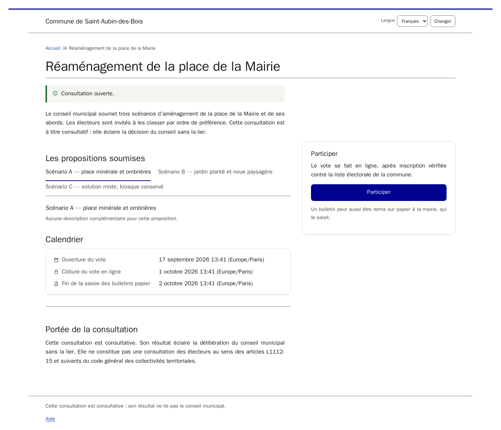
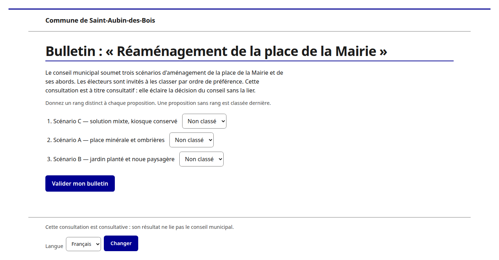
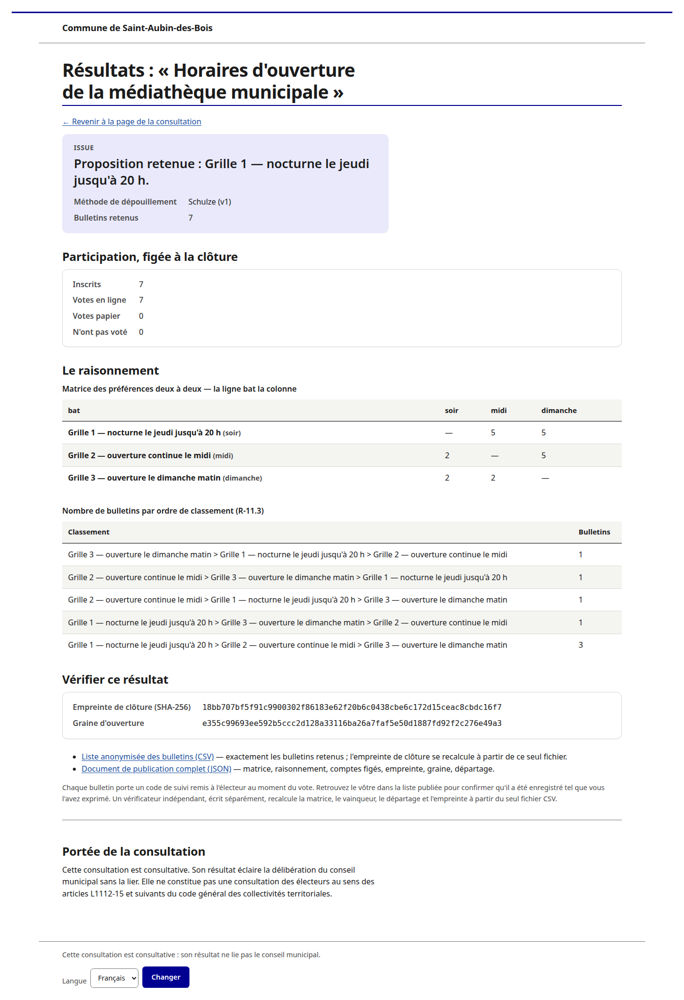

<!-- SPDX-License-Identifier: 0BSD -->

[Version française](README.md)

# Plateforme de consultation citoyenne

Ask your residents a question, let them answer online or on paper, and publish
a result that anyone — a resident, a local journalist, an opposition
councillor — can recompute for themselves instead of taking the town hall's
word for it. That is what this software is for.

Self-hosted web application for a French commune to run **consultative** polls
of its registered electors: a participatory-budget vote, a street-name choice,
a planning consultation, a satisfaction survey. Ballots are cast online, or on
paper and keyed in by a council member. Preferential polls are tallied by the
Schulze method; single-choice and approval polls are also supported.

One instance per commune. Adoption by another commune means another instance,
never a tenant column, and never a third party holding your electors' data.

Written to [`spec-plateforme-vote.md`](spec-plateforme-vote.md), which restates
the functional requirements — the `R-x.y` numbers cited throughout — in
implementation terms. Departures of the code from the specification are recorded
in [`docs/specification-decision-log.md`](docs/specification-decision-log.md).

## Why a council would choose this

- **Free, and yours.** 0BSD licence — no subscription, no per-poll fee, no
  vendor. The commune runs its own instance and keeps its own data; see
  [Licence](#licence) below.
- **No one can see how a resident voted — not even the town hall.** A
  registration proves who is entitled to vote; a ballot is anonymous from the
  moment it is cast. The two are never joined, in the application or in the
  database (`INV-1`, enforced by a database trigger, not just application
  code).
- **The count is public, not just announced.** Closing a poll publishes the
  anonymised ballots and a fingerprint of the result. Anyone can download the
  free [verifier](docs/manuel/verifier-en.md) and check the outcome
  themselves, with no account and no trust required in the software that
  produced it.
- **Fits how a real poll runs.** Most communes still have residents who won't
  or can't vote online — a paper ballot, keyed in and countersigned by a
  council member, sits alongside the online channel rather than being an
  afterthought.
- **A record that can't be quietly edited.** Every consequential action —
  a registration decision, a ballot correction, a role grant — is written to
  an audit log with no update or delete path, so "what actually happened" is
  never just someone's word.
- **In French, for a French commune's rules.** The interface, the electoral
  roll matching and the legal caveats below are built around
  `cahier-des-charges.md`, the CNIL and ANSSI guidance a French DPO already
  has to answer to — not translated from a generic product built for
  somewhere else.

Skim the [screenshots](#screenshots) below, then read
[**Is this the right tool for you?**](#what-this-software-is-not-for) before
you commit any budget to it — it is deliberately narrow about what it is not
for.

## Main features

- **Electoral roll import and registration** (§6.1–6.2) — the commune imports
  its working roll as a CSV; residents register online and are matched against
  it by name and address, with anything ambiguous sent to manual review rather
  than guessed at.
- **Voting, online and on paper** (§6.3–6.4) — electors cast or revise an
  online ballot up to closure; a council member can key in a paper ballot
  instead, with automatic detection if that elector already voted online.
- **Three tally methods** (§8) — single-choice, approval, and Schulze
  (Condorcet) for ranked preference, with the full pairwise matrix and
  tie-break reasoning shown alongside the result, not just the winner.
- **Publication anyone can recompute** (§9) — closure produces a closure hash,
  an anonymised ballot CSV and a JSON bundle; an independent Rust verifier
  (`verifier/`), sharing no code with the Python tally, recomputes the same
  result from the published files alone.
- **Espace mairie** (§6.5) — fourteen back-office screens (dashboard,
  configuration, roll, registration queue, paper ballots, closure and
  publication, operator accounts, per-poll roles, audit log, commune
  settings), each reachable only through an audited per-poll role grant —
  never a superuser flag.
- **Append-only audit log** (§10) — every consequential action is logged by
  reference, with no identifying data and no update or delete path, in the
  application or the database.

## Screenshots

  
  

  
  

From left to right, top to bottom: the public page of an open poll, an
elector's online ballot, the espace mairie dashboard for that poll, and the
public results page with the Schulze reasoning and the closure hash anyone can
verify. More screens — the registration flow, paper-ballot entry, the roll
import, roles and the audit log — are captured for every role in
[`docs/manuel/`](docs/manuel/captures/README.md) (French), which also
documents how to regenerate them from a throwaway demo database.

## What this software is not for

**Not legally binding elections.** No strong voter authentication, no
end-to-end verifiable cryptography. The verifiability model is
publication-based: the anonymised ballot set is published, and anyone can
recompute the result and the closure hash from it.

**Receipt-freeness is not provided, and is not attempted.** A voter who keeps
their tracking code can find their own row in the published CSV and so prove to
a third party how they voted. This is inherent in publication-based
verifiability — the property that lets any reader recompute the result is the
same property that makes a ballot findable by someone holding its code. It is
accepted because the poll is consultative, and it means this software **must not
be used where coercion or vote-buying is a realistic risk**.

## Regulatory risk level, for a DPO

The CNIL's recommendation on the security of electronic voting is
**délibération n° 2026-045 of 19 March 2026** (published 24 April 2026), which
repealed the 2010 and 2019 texts, accompanied by ANSSI technical guide
**ANSSI-PA-118**; the two are designed to be read together.

**This software is designed to meet risk level 1** — a low-stakes consultative
poll, of the kind that is probably outside the scope of a text aimed at
secret-ballot elections. **It is not designed for level 2 or 3**, which is where
a participatory budget in a city of fifty thousand may well land. An adopting
commune's DPO should be able to answer the question from this section without
reading the source; if the poll in question is not clearly level 1, this is not
the right software for it.

Ballots already in preparation for 2026 may continue under the 2019 version;
any new ballot falls under the new text.

## Documentation

[`docs/manuel/`](docs/manuel/README.md) is written for the people who will
actually use the software, not for developers — it never assumes you have
read the specification, and it is served by the application itself so it
never goes stale. French is the reference language; every guide below has an
English translation except the instance administrator's guide, which assumes
you are comfortable reading French documentation to run a French commune's
server:

| You are… | Read… |
|---|---|
| the IT contact installing and running an instance for the commune | [Guide de l'administrateur d'instance](docs/manuel/guide-administrateur.md) (French only) |
| an elected official or agent working in the espace mairie | [Espace mairie guide](docs/manuel/guide-espace-mairie-en.md) |
| an elector invited to a poll | [Voter's guide](docs/manuel/guide-electeur-en.md) |
| anyone who wants to check a published result by hand | [Verify a result yourself](docs/manuel/verifier-en.md) |
| anyone who wants to understand how a result is reached | [The tally methods, explained](docs/manuel/methodes-de-depouillement-en.md) |
| any of the above, with a specific question | [FAQ](docs/manuel/faq-en.md) |

## Installation

`ansible/` is the supported path: a bare Debian VM to a running instance by
editing one inventory file and running one command — see
[`ansible/README.md`](ansible/README.md) and the full
[guide de l'administrateur d'instance](docs/manuel/guide-administrateur.md)
(French) for installation, deployment, backup, restore and supervision. A
container image is the alternative, not yet built (see Build status below).
`contrib/init/` carries service files for systemd, OpenRC, FreeBSD and
OpenBSD — **Debian is playbook-installed and tested in CI; the other
platforms are best effort, installation by hand.**

## Quick start (development)

For working on the code itself, not for running a poll:

    uv sync
    mkdir -p var/locks var/media var/static
    uv run python manage.py migrate
    uv run python manage.py runserver

Tests, lint and types:

    uv run pytest -q
    uv run ruff check .
    uv run mypy src tests
    cargo test --manifest-path verifier/Cargo.toml

## Layout

    src/config/            Django project: settings, URLs, WSGI
    src/apps/core/         Types, crypto (§7), canonical serialisation (§9),
                           name matching (§6.2), tracking codes, job locking
    src/apps/elections/    Poll, options, roll snapshot, the one transition
                           function (§5.1), the voting window (INV-2), closure
                           and publication (§9), retention (§11)
    src/apps/registrations/ Registration and review — no relation to ballots
    src/apps/ballots/      Ballot and PaperBallotLink — no relation to voters
    src/apps/audit/        Append-only, reference-only audit log (§10)
    src/apps/tally/        Pure tally functions (§8); imports no model
    src/apps/backoffice/   Espace mairie (§6.5) — the majority of the build
    src/apps/publicsite/   Public pages (§6.6) and GET /sante
    verifier/              Independent Rust verifier; shares no code (§14)
                           core/ verification logic, cli/ and gui/ front ends
    ansible/               Deployment (§15)
    docs/                  Canonical serialisation, spec divergences,
                           manuel/ (French user manual, all four roles)

## Properties that must not be broken

Read §5, §7 and §10 of the specification before touching the domain, and
[`CONTRIBUTING.md`](CONTRIBUTING.md) before opening a pull request. In short:
no query may join a registration to an online ballot; voting status lives on
`Registration.channel`; the audit log holds references and non-identifying
state only, and has no update or delete path; the closure hash depends on option
ids and tracking codes alone.

## Build status

Implemented and tested — the CI gates (`compilemessages`, `makemigrations
--check`, `ruff`, `ruff format`, `mypy --strict`, `pytest`) and the Rust
`cargo test` are green:

- the domain model and its migrations, and the database triggers enforcing
  INV-2, INV-3, INV-6 and INV-7;
- the transition function and its guards, the voting window, closure, the
  closure hash and publication artefacts, the tally, the tie-break, retention;
- the anonymity scheme (§7), name and address matching;
- the roll import (§6.1), the registration and review flow (§6.2), online
  casting and modification (§6.3), paper entry, correction, deletion and
  countersignature (§6.4);
- all fourteen back-office screens (§6.5), the public poll and results pages
  and `GET /sante` (§6.6);
- the management commands, with the locking and state-based selection §14
  requires, and the mail templates they send;
- the `en` message catalogue (French is the msgid language);
- the independent Rust verifier and its cross-check against the Python tally;
- the Ansible role — `provision`, `deploy`, `backup`, `restore`, `smoke` (§15).

Every acceptance test T-1…T-81 (§12) has a test or a Molecule scenario.

Outstanding:

- **T-16 and T-38** run only in the dedicated CI `molecule` job — they need a
  throwaway systemd host, not the pytest database — and **T-13**'s
  screen-reader pass stays a manual step before each poll opens (the
  keyboard-only half is automated).
- No prebuilt **container image** or no-toolchain deployment guide yet, and no
  generated **third-party licence notice** (§14).
- **RGAA conformance audit** of the markup (R-14.1) and an **email
  deliverability test** to real mailboxes (§14) are pre-launch tasks, not code.
- The §13 items — first-poll option labels, enabled languages, opening and
  closing instants, the data-protection referent, the paper-workflow toggles,
  the keying window, postal enrolment, `review_all_registrations` — are wired
  as configuration and await the commune's values.

## Licence

[0BSD](LICENSE), documentation and specifications included. See
[`PROVENANCE.md`](PROVENANCE.md) for how the code was produced.
