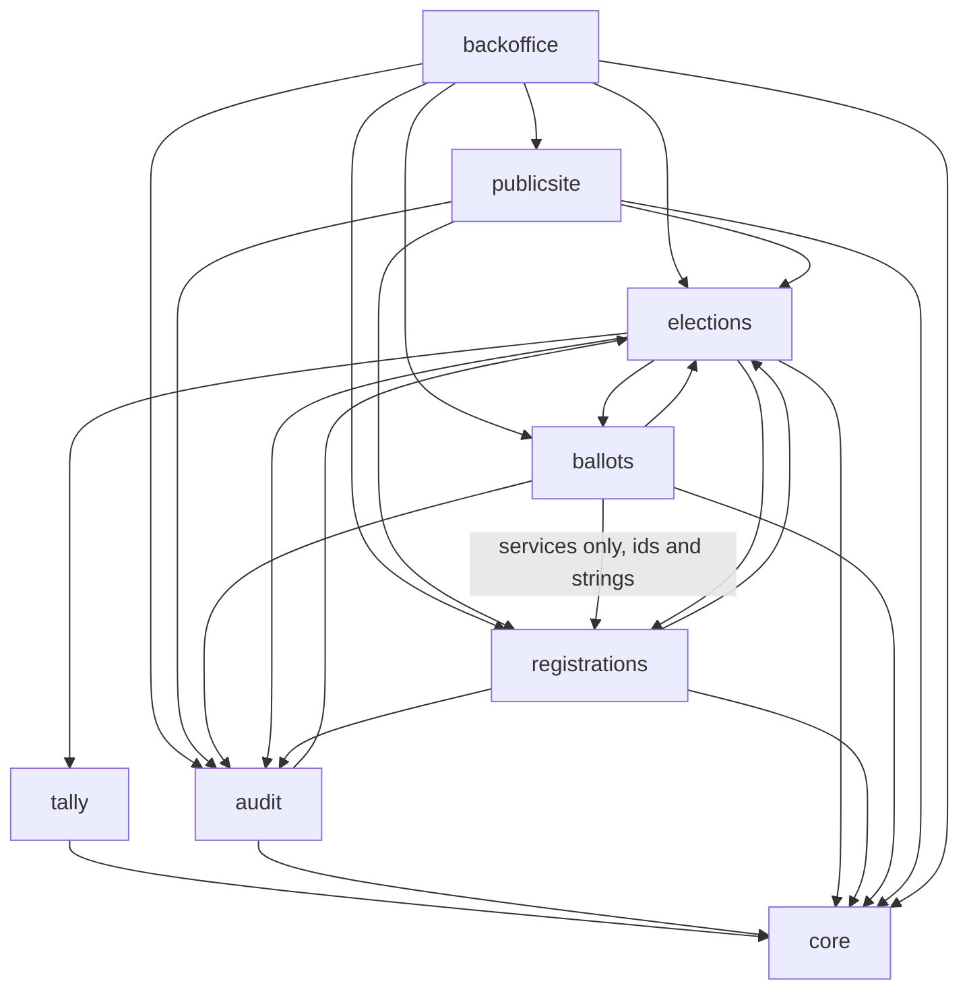
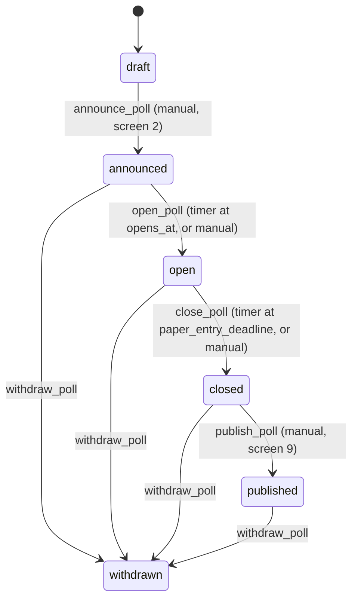
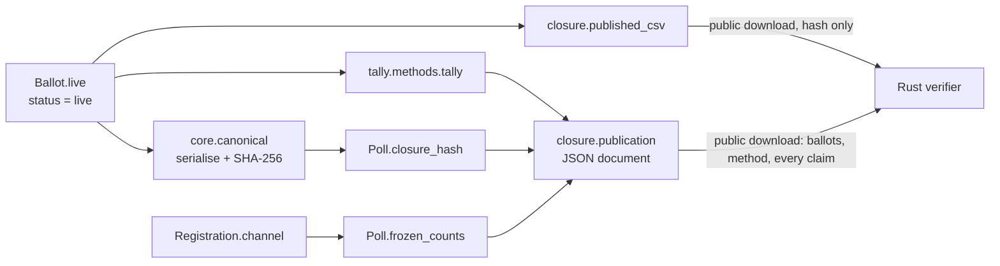

<!-- SPDX-License-Identifier: 0BSD -->

# Architecture

A map of the code for a reviewer who has not read it yet. The functional
requirements (`cahier-des-charges.md`, `requirements-en.md`, rules `R-x.y`) and
the implementation specification (`spec-plateforme-vote.md`, sections `§n`,
invariants `INV-n`, acceptance tests `T-n`) are the authority; this page only
shows where each part of them lives. Where the code departs from the
specification, `specification-decision-log.md` records why.

## What the system is

A self-hosted Django application that runs consultative polls for a single
French commune. Electors register online against the electoral roll, receive
a single-use link by email, and cast a ranked ballot. People who vote at the
mairie have their paper ballots keyed in by an operator. At closure the live
ballots are hashed. The anonymised ballot list, the hash and the tally are
published, and an independent Rust program recomputes them from the published
file alone.

The design rests on one privacy property: **an online ballot cannot be traced
back to the person who cast it** (INV-1). Everything below is arranged around
keeping that true.

## Components

| Component | Path | Responsibility |
|---|---|---|
| Settings, root URLs | `src/config/` | Environment-specific settings (`dev`, `test`, `prod`); SQLite in WAL + `IMMEDIATE` mode; no Django admin. |
| core | `src/apps/core/` | Shared foundations with no poll logic: distinct hash types (`types`), the §7 token scheme (`crypto`), canonical serialisation and closure hash (`canonical`), tracking codes, name matching (`names`), job locking (`jobs`), rate limiting, token/session handling on ballot routes (`tokensession`), SMTP relay (`mailbackend`, `secretstore`), image sniffing, manual rendering, and the `User`/`PollRole`/`Commune`/`MailSettings`/`JobRun` models. |
| tally | `src/apps/tally/` | Pure functions: Schulze, plurality, approval (`methods`) and the hash-chain tie-break (`tiebreak`). Imports no model and no Django (INV-9). |
| audit | `src/apps/audit/` | The append-only `AuditEvent` log and its single writer `services.record` (INV-3, §10). |
| elections | `src/apps/elections/` | `Poll` and its options, images and templates; the roll (`WorkingRollEntry`, frozen `RollEntry`) and its import; **the only module that changes poll state** (`transitions`); the voting window (`windows`); closure, publication and retention; sandbox polls and share links. |
| registrations | `src/apps/registrations/` | `Registration` (identity, `voter_hash`, voting `channel`), roll matching, confirmation and reminder mail. |
| ballots | `src/apps/ballots/` | `Ballot` (anonymous, versioned), `PaperBallotLink`, `ReconciliationRecord`; online cast/modify and paper entry/correction/countersignature. |
| publicsite | `src/apps/publicsite/` | Public pages: poll list and detail, results and their CSV/JSON, public manual, `/sante`. |
| backoffice | `src/apps/backoffice/` | The *espace mairie*: 14 numbered screens plus poll creation and the manual, all behind `access.py`. |
| verifier | `verifier/` | Independent Rust verifier. `core/` has zero dependencies; `cli/` and `gui/` are front ends. |
| Deployment | `ansible/`, `contrib/init/` | nginx + gunicorn + systemd timers (or cron), backups, firewall; init scripts for other platforms. |

## App dependencies

Generated from the actual `import` statements in `src/apps/` (migrations
excluded). An arrow means "imports from".



Two edges are forbidden and tested (`tests/integration/test_inv1_separation.py`):

* `registrations` never imports `ballots`, in any module.
* Neither app's `models.py` imports the other's.

`ballots.services` and `ballots.views` do call `registrations.services`, but
they pass and receive only ids and plain strings, never a `Registration`. That
way a voter and a ballot never sit together in one object that a later change
could turn into a join. `elections` imports both, from `closure`,
`retention`, `sandbox`, `transitions` and `windows`. `closure` reads the two
tables separately: counts come from `Registration` and the hash from
`Ballot`, and the two meet only as integers. `retention` and `sandbox` delete
from both. `transitions` and `windows` need only ballot enums and the
reconciliation record.

## Key flows

### A poll's life



Every arrow is a function in `elections/transitions.py`, the only module that
assigns `Poll.state` (tested). The database trigger `poll_state_irreversible`
is the actual enforcement. Configuration freezes when the poll leaves `draft`
(INV-6): `Poll.save()` produces the error message and the triggers enforce it.
A sandbox poll can also be deleted, from any state
(`elections/sandbox.delete_poll`, R-3.7, decision log #26); no other poll can.

**The clock refuses, the state admits** (decision log #33). Ballot and
registration writes go through `elections/windows.py`, which requires the
poll to be `open` *and* compares the clock against `opens_at`, `closes_at` and
`paper_entry_deadline`. Nothing relies on `state` to refuse a write past a
deadline, so a `close_poll` that runs late, twice, or not at all lets nothing
through late. A late `open_poll` delays the start of voting, which no rule
could avoid, since the snapshot it takes is what registration and paper entry
read. The dashboard and `/sante` flag it. The INV-2 triggers enforce the same
rule.

### Registering and voting online

```mermaid
sequenceDiagram
  actor E as Elector
  participant R as registrations.services
  participant S as RollEntry snapshot
  participant M as Mail (on_commit)
  participant B as ballots.services
  E->>R: register(name, date of birth, email)
  R->>S: match (date of birth + names, R-5.3)
  alt one eligible match
    R->>R: create pending_email, voter_hash = H("voter"||salt||token)
    R->>M: confirmation link containing the token
  else none / several / uncertain
    R->>R: create pending_review (poll admin decides, screen 4)
  end
  E->>B: follow link /bulletin/<poll>/acces/<token>/
  B->>R: arrive(token) → pending_email becomes active
  E->>B: POST ranking to the same token URL
  B->>R: token_channel(token): must be active, channel none
  B->>B: insert Ballot (tracking code; ballot_hash only if modification allowed)
  B->>R: mark_voted(registration_id, "online")
  B-->>E: redirect to token-free receipt
```

The plaintext token exists only in the email and in the one request that
presents it. The database holds `voter_hash` on the `Registration` and,
where modification is allowed, `ballot_hash` on the `Ballot`. The two use
different domain prefixes, so neither can be derived from the other without
the token (§7, `core/crypto.py`). A modification link swaps the token for a
session entry that holds only the `ballot_hash` (`core/tokensession.py`).

"Has this person voted" is answered by `Registration.channel` and nothing else
(INV-5). Online casts write **no** audit event, because an event written in
the same transaction as the `channel` change would link voter and ballot by
timing.

### Paper ballots

An entry operator searches the frozen roll, confirms the elector and keys the
ranking in (screen 5, `ballots.services.enter_paper`). This creates a `Ballot`
plus a `PaperBallotLink` to the roll entry. On the paper channel the link to
the voter is deliberate (R-8.2 bis) and removed by the retention purge.
Depending on the poll's settings the ballot waits in `pending_countersign`
for a second operator (screen 7). The poll may also require a signed
reconciliation record before it can close (screen 9).

### Closure, publication, verification



`close_poll` computes and stores the closure hash and the participation
counts. The counts are stored because the registrations they come from are
deleted two months later. The tally is not stored: it is recomputed from the
live ballots each time it is needed and logged at publication. The byte format
the hash covers is set out in `docs/canonical-serialisation.md`; Python, the
CSV and the verifier all have to follow it. The verifier's usual input is the
JSON publication document, whose layout is `docs/publication-format.md`. It
recomputes the hash, the matrix, the counts, the winner and the tie-break
from the document's ballots and checks each value the document states.

### Retention

`retention_purge` (daily) deletes registrations, roll entries, paper links and
duplicate-attempt flags 61 days after a poll closes (or after withdrawal, if
the poll never closed). It also deletes the working roll 61 days after the
last import once no poll still needs it. Ballots, results and the audit log
stay. Because audit events hold only references, deleting the referenced rows
is what anonymises the log.

## External interfaces

| Interface | Where | Notes |
|---|---|---|
| HTTP (public) | `publicsite/urls.py`, `ballots/urls.py`, `registrations/urls.py` under `/<lang>/` | Ballot routes are under `/<lang>/bulletin/`. nginx does not log that prefix, and `core/logging.py` redacts it from Django's own logs. |
| HTTP (back office) | `backoffice/urls.py` under `/<lang>/mairie/` | Session login for named accounts; no self-service sign-up. |
| Health | `GET /sante` | Version and whether migrations are pending; no counts. |
| Published artefacts | `/<lang>/scrutin/<id>/resultats/?format=csv` / `?format=json` | Only once the poll is `published`. |
| SMTP | `core/mailbackend.py` | Relay configured on screen 12, falling back to environment settings. All mail is sent from `transaction.on_commit`. |
| Scheduled jobs | `manage.py open_poll`, `close_poll`, `send_reminders`, `retention_purge` | Run by systemd timers (`polls-job@.timer`) or cron. Each job holds its own lock (`core/jobs.py`), selects work by state, and can safely run more than once. |
| CLI | `manage.py import_roll`, `run_tally` | Terminal counterparts to screen 3 and screen 9's derivation. |
| Database | SQLite, `var/polls.sqlite3` or `DJANGO_DB_PATH` | Triggers in `elections/migrations/0002_invariant_triggers.py` and later migrations enforce INV-2/3/6/7. |

## Back-office screen map

Every route taking a `poll_id` is wrapped in `access.require_poll_role`.
`tests/integration/test_backoffice_access.py` fails on any that is not.

| # | Screen | Views (`backoffice/views.py`) | Gate | Read model | Write path |
|---|---|---|---|---|---|
| 1 | Tableau de bord | `poll_dashboard` | any poll role | `dashboard.py` | none (links to other screens) |
| 2 | Configuration | `poll_config`, `poll_preview`, `poll_sandbox`, `poll_image_upload`, `poll_image_delete` | poll admin; auditor read-only | `forms.py` | `elections.config`, `elections.transitions`, `elections.sharelink`, `elections.sandbox`, `elections.pollimages`, `elections.polltemplates.save_as_template` |
| 3 | Import de la liste | `roll_import`, `roll_import_review` · `roll_status` | commune admin · poll admin, auditor | `rollbrowse.py` | `elections.rollimport` |
| 4 | Inscriptions | `registration_queue`, `registration_decide`, `registration_resend` | poll admin | `review.py` | `registrations.services` |
| 5 | Saisie papier | `paper_entry`, `paper_receipt` | entry operator (receipt: also poll admin) | `paper.py` | `ballots.services.enter_paper` |
| 6 | Rectification | `paper_ballot_list`, `paper_ballot` | entry operator | `paper.py` | `ballots.services.correct_paper`, `delete_paper` |
| 7 | Contreseing | `countersign_queue` | entry operator (not the one who keyed it) | `paper.py` | `ballots.services.countersign` |
| 8 | Journal d'audit | `audit_log` | auditor, poll admin | `auditlog.py` | logs its own access |
| 9 | Clôture et publication | `results_publish` | poll admin, auditor (POST: admin only) | `elections.results_view` | `ballots.services.record_reconciliation`, `elections.closure.record_physical_tiebreak`, `elections.transitions.publish_poll` |
| 10 | Comptes et rôles | `account_admin`, `role_admin` | commune admin | `accounts.py` | `accounts.py` |
| 11 | Première installation | `first_run` | only while no account exists | none | `firstrun.py` |
| 12 | Messagerie | `mail_settings` | commune admin | `mailsettings.py` | `mailsettings.py` |
| 13 | Modèles | `template_admin` | commune admin | `elections.polltemplates` | `elections.polltemplates` |
| 14 | Commune | `commune_settings`, `commune_*_upload`/`_remove` | commune admin | `communesettings.py` | `communesettings.py` |
| – | Nouveau scrutin | `poll_create` | commune admin | none | `elections.config.create_poll` |
| – | Aide | `manual_index`, `manual_page`, `manual_image` | any signed-in operator | `core.manual` | none |

Every definitive action in the table (announce, open, close, extend, withdraw,
publish, reconciliation, sandbox deletion) first renders
`backoffice/confirm.html` from `confirmations.py`, and runs only on a second
POST carrying `confirmed=1` (R-2.4, decision log #35).

`commune_admin` grants nothing on any individual poll, and `is_superuser` is
never checked. Reaching a poll's screens always goes through an audited
`PollRole` grant.
