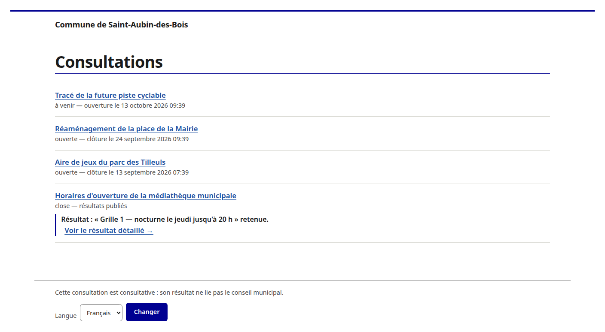
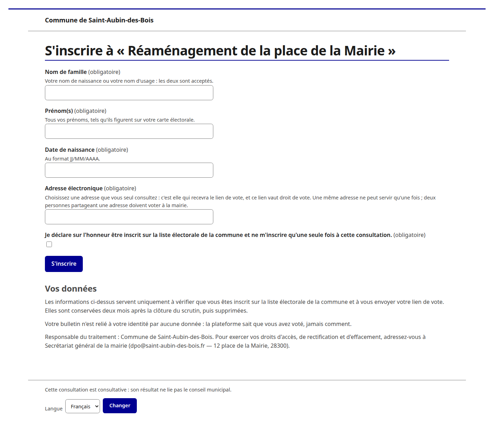
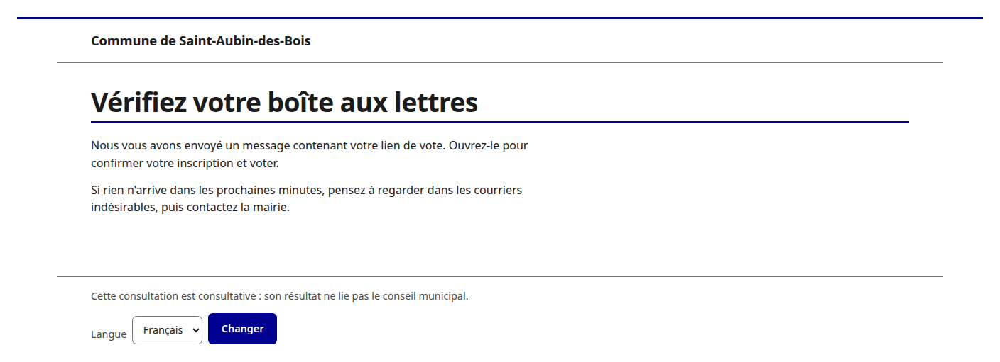
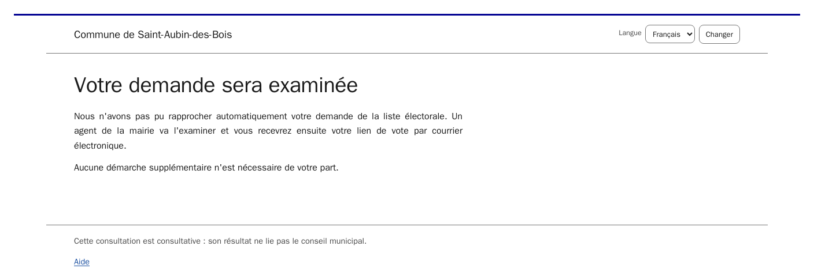
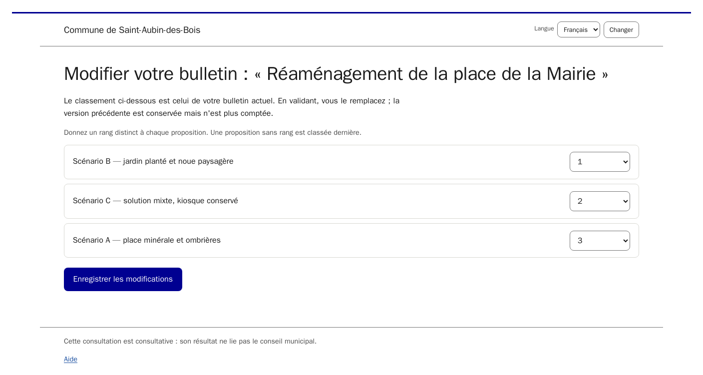
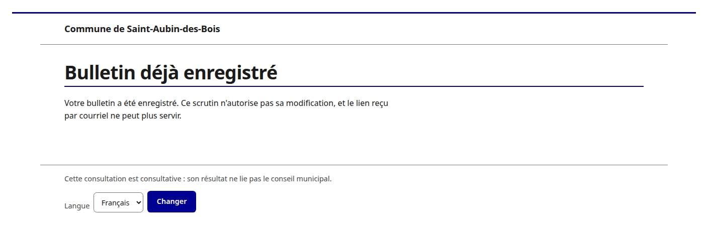

<!-- SPDX-License-Identifier: 0BSD -->

# Voter's guide

You are on the commune's electoral roll and have been invited to take part in
a **consultation**. This guide explains how to register, vote, and check that
your vote was recorded correctly.

## In brief

- **The consultation is advisory.** Its result **informs** the municipal
  council's decision; it does not bind it. This notice appears on every page.
- **Two ways to vote**: online, or on paper at the mairie if you have no
  internet access. You cannot do both.
- **Your online ballot is never linked back to your identity by any stored
  data**: the platform knows that you voted, never how.
- **The link sent by email is precious.** Depending on the poll, it is the
  only way to change your vote, and no one — not even the mairie — can
  retrieve it or send you another one.

## 1. Finding the consultation

The public page lists upcoming, open and closed consultations.

**Figure 1 — Public list of consultations.**

Each row shows its status — **upcoming** (with the opening date), **open**
(with the closing date), or **closed** — and, once results are published, the
result itself (proposition retained, tie, or no ballot retained), with a link
to its full detail.

An **upcoming** consultation is one the mairie has chosen to make public
before it opens: you can already read the propositions and the schedule, but
registration and voting only open on the date shown. The configuration shown
is already frozen and will not change before opening.

**Figure 2 — Public page of an upcoming consultation, not yet open.**

The page of an open consultation shows the propositions — some accompanied,
under their title, by a more detailed description with images or a video —
the closing date and time, the paper-ballot keying deadline where it differs,
any **closing-date extension** already decided (with its reason), and the
reminder of the consultation's advisory nature.

**Figure 2a — Public page of an open consultation.**

The number of voters **is not shown** while the poll is running, unless the
configuration provides for it: publishing turnout while voting is under way
could influence it.

> **If a consultation is withdrawn**, its page shows only a withdrawal notice:
> the title, the propositions and any result disappear, even if you follow a
> link received by email before the withdrawal.

## 2. Registering

Registration is **specific to one poll**. If you take part in two
consultations at the same time, you register twice and receive two
independent links.

**Figure 3 — Registration form.**

The form asks for:

- your **surname** — your **birth surname** or your **name in use**, both are
  accepted;
- your **first names**;
- your **date of birth**;
- your **email address**;
- a **sworn declaration** (checkbox) that you are on the commune's electoral
  roll.

Tips:

- **Choose an address only you check.** The guarantee that your voting link
  stays private rests on this.
- **An address can only be used once per poll.** Two people who share a
  mailbox cannot both register online: one of them votes on paper at the
  mairie.
- The date of birth carries most of the weight of the check; name comparison
  is tolerant (case, accents, hyphens, particles, order of first names).

### What happens next

| Situation | Message | Next step |
|---|---|---|
| Exactly one roll entry matches, and it gives eligibility | "A confirmation email has just been sent to you" | open the link received |
| No match, or several — or an uncertain date of birth | "Your registration is under review" | the mairie decides; you are contacted again |
| Exactly one entry matches but its electoral-list type does not give a vote on this poll | "You are not eligible for this consultation" | — |
| The roll entry or the address is already registered | "We cannot record this request online. Please contact the mairie." | contact the mairie |

**Figure 4 — Acknowledgement: confirmation email sent.**

**Figure 5 — Acknowledgement: registration under review.**

For your protection, the name found on the roll **is never shown back to
you** before you have confirmed your address: without this, the form would
become a way to check, from a name and a date of birth, whether a person is
registered.

## 3. Confirming your address and reaching your ballot

The confirmation email contains **a link**. Opening it proves the address is
yours **and** takes you straight to your ballot. The email:

- states the closing date;
- if the poll allows changes, states that **this link is the only way to
  change your ballot**, that no one can retrieve it, and that **if you lose
  it, your vote stays recorded and counts normally** — you will simply no
  longer be able to change it;
- carries **no tracking code**: the code relates to a ballot, which does not
  exist yet at registration time. You are given it **when you vote**.

**Keep this email** until closing.

## 4. Voting

**Figure 7 — Ballot: first vote.**

- **The order of the propositions is randomised for each voter**,
  independently of the order in the configuration.
- You rank the propositions according to the poll's rules (a complete ranking
  required or not, ties allowed or not). These rules are **checked on the
  server**, not only in the browser.
- Ranking works with the keyboard and a screen reader: numbered drop-down
  lists (or up/down buttons) are always available alongside drag-and-drop.
- If the poll **does not allow** changes, the page tells you **before**
  submission: your ballot is cast only once.

After submission, a **summary** of your ranking and your **tracking code**
are shown, and you receive them **by email**. Keep the code: after closing,
it lets you find your ballot in the published list, **without revealing your
identity**.

## 5. Changing your vote (if the poll allows it)

Reopen the **link received at registration**. You can change your vote as
many times as you like until closing.

**Figure 8 — Ballot: change.**

- Each change creates a **new version**; the previous one is kept but no
  longer counted. Your **tracking code does not change**.
- No new email is sent: the summary is shown on screen, and the code is the
  one you already hold.
- **If you have lost the link**, you can neither recover it nor change your
  ballot — but **it remains counted**.

If you reopen the link while the poll does not allow changes, or you have
already voted on a poll with no changes allowed, a message tells you so.

**Figure 9 — "A ballot has already been recorded" message.**

## 6. Reminder

48 hours before closing, a **reminder** is sent to registered people who have
not yet voted. It carries no new link: use the one from your registration, or
contact the mairie.

## 7. Voting on paper

If you have no internet access, go to the mairie. A council member records
your ballot on your behalf after identifying you on the electoral roll, and
gives you a **receipt bearing your tracking code**.

> **Important.** A ballot cast **on paper stays associated with your
> identity** in the system — unlike a ballot voted online — for traceability
> and to allow it to be deleted at your request. This association is erased
> two months after closing.

If you have already voted on paper, online voting is refused to you (contact
the mairie to have the paper ballot deleted first). If you have already voted
online, the mairie cannot key in a paper ballot on your behalf: the online
vote stands.

## 8. Verify, after closure

**Figure 20 — Public results page.**

Once published, the **result** — proposition retained, tie, or no ballot
retained — is shown at the top of this page: you do not need to read through
the matrix or the reasoning to know what came out of it. The same result,
more briefly, also appears directly on the public list of consultations
(figure 1). The results page then carries:

- the **anonymised list of ballots** (tracking code + ranking), in CSV and
  JSON;
- the **pairwise preference matrix** and the **reasoning** leading to the
  result;
- the number of registered voters, of ballots per channel, of voters who did
  not vote;
- the **opening seed**, the detail of any tie-break, and the **closure
  hash**.

You can:

1. **find your tracking code** in the list and check that the ranking shown
   is the one you cast;
2. **recompute the result yourself** from the published data — an
   independent implementation of the tally and the hash is published for
   this purpose. See [Verify a result yourself](verifier.md) for step-by-step
   instructions, with no prior technical skill required.

> **Worth knowing.** If you keep your tracking code, you can find your own
> row in the published file and thus prove to a third party how you voted.
> This is inherent to a verifiability built on publication. This platform
> **must not be used where coercion or vote-buying are a real risk**.

## 9. Accessibility and languages

The interface complies with RGAA, is usable on a phone, and is available in
French; other languages are offered where the consultation enables them.
French is authoritative; pages with legal standing (notices) recall this when
read in a translation.
