<!-- SPDX-License-Identifier: 0BSD -->

# Mairie area guide

The mairie area (`/mairie/`) is the administration interface: council
members and staff use it to create polls, import the electoral roll, process
registrations, key in paper ballots, close and publish. It is in French,
complies with RGAA, is usable on a phone, and **never places a destructive
action next to a routine one**.

> **What the mairie area does not allow.** Linking a voter who voted
> **online** to the ballot they cast. No role allows this. An
> administrator only ever has two irreconcilable lists: names with a
> "voted / did not vote" flag, and anonymous rankings identified by their
> tracking code. The one deliberate exception is the **paper**
> ballot-entry screen, where the association is intentional, logged, and
> erased at the retention deadline.

## 1. Roles and access

Roles are assigned **poll by poll**, except for the commune administrator
role.

| Role | Scope | Permissions |
|---|---|---|
| **Commune administrator** | commune | Creates polls; assigns each poll's roles; imports the electoral roll. **Grants access to no ballot** and to no individual poll's screens. |
| **Poll administrator** | one poll | Changes the configuration while the poll is a draft; announces, opens, closes and publishes; decides on registrations under review; extends the closing date. |
| **Entry operator** (a council member) | one poll | Keys in, corrects and deletes paper ballots; issues receipts. |
| **Auditor** | one poll | Read-only: configuration, anonymised list of ballots, **the whole** audit log. |

Checks applied to **every** screen of a poll (`apps/backoffice/access.py`):

- `commune_admin` **is not a superuser**. The flag opens the commune-level
  screens (accounts, roles) and the poll index; it grants no role on any
  poll. A commune administrator who needs to key in a paper ballot **assigns
  themselves** the operator role first, which writes an audit event. This is
  deliberate: the screen where a voter appears next to ballot content must be
  reached through a grant someone made, not a flag someone holds.
- `is_superuser` is **never** consulted.

### Signing in

Every operator has a **named account**. Shared accounts are
forbidden by construction. The signed-in person's name is shown at the top
of every screen: at a glance, you should be able to see under whose name the
audit log will record the actions taken.

**Figure 6 — Signing in to the mairie area.**

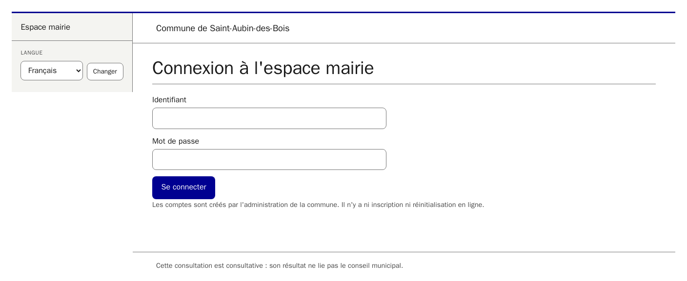

## 2. Setting up a brand-new instance

1. **First-run setup** (`/mairie/installation/`) — screen 11. Available only
   as long as no account exists; it closes for good afterwards. In one
   transaction, it creates:
   - the **commune's record**: name shown on the public pages, **data-
     protection referent** and **the referent's contact details** (to whom
     voters address access, rectification and erasure requests);
   - the **first commune administrator account**.

   These three fields of the commune's record, along with the site's
   address and an optional logo/favicon, remain editable afterwards from the
   **commune settings** (screen 14).
2. **Accounts and roles** (screen 10) — create accounts for council members
   and staff, then, once a first poll has been created, assign them roles on
   that poll.
3. **Electoral roll import** (screen 3).
4. **Create the first poll** (below) then **configure it**.

**Figure 18 — Operator accounts.**

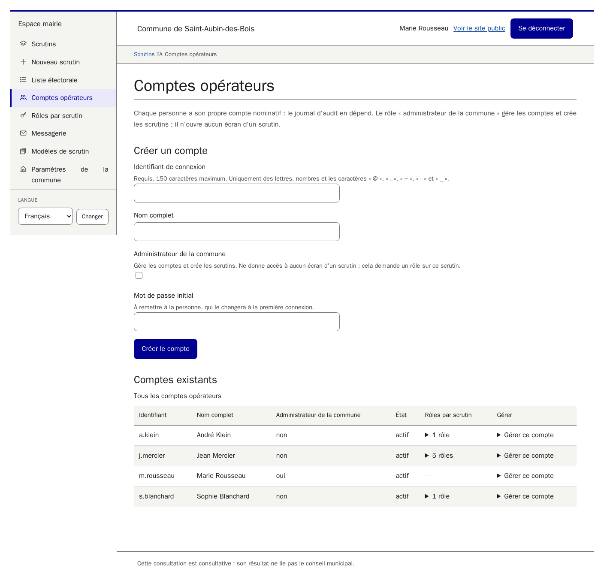

**Figure 19 — Roles per poll.**

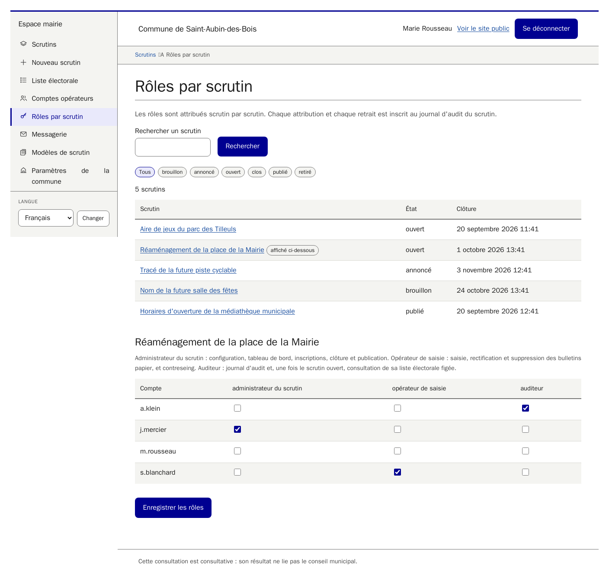

The screen is worked through in two steps. The **poll** is searched for and
picked from a paginated list, searchable by title and filterable by state —
not from a single drop-down, which would grow without limit as the commune's
polls pile up. With the chosen poll shown, a **grid** puts every **active
account** in a row and every **role** in a column: a checked box grants,
an unchecked box removes, all sent in a single save — only the boxes
actually changed write an event to the log, one grant or removal at a time
. A deactivated account no longer appears in the grid: it cannot
receive a new role, and removing a role it still holds requires reactivating
it first, which makes it reappear, checked, so it can be removed from it.

Every role assignment is logged.

### Creating a poll (`/mairie/nouveau/`)

Reserved to the **commune administrator** (like screens 10 and 12): a poll
that does not exist yet has no poll administrator to reserve the screen to.
Reuses screen 2's form and proposition editor — the initial
configuration takes the same shape as a change — adding only one field
screen 2 excludes: the **sandbox** flag, fixed once and for all at
creation.

Two ways to start:

- **empty**: a single input language to begin with (the deployment's default
  language); adding others is done as on screen 2, by changing the set of
  languages and then saving;
- from a **template** (screen 13, below): the tally method and the ballot's
  constraints are carried over from the chosen template, but the title,
  description and propositions are always entered afresh — a template never
  carries content.

Creating a poll **grants no role** on it, not even to whoever just created
it: validation goes straight back to "Roles per poll" (screen 10) so
that the grant stays the separate, logged step it is everywhere else.

### Poll templates (screen 13)

Reserved to the commune administrator, like screens 10 and 12. A catalogue
of named templates, shared across all of the commune's polls — name, tally
method, creation date — each one renameable or deletable from this screen.
Nothing else creates or changes a template: the only place that writes one
is *save as template*, available on screen 2 **regardless of the
poll's state**, since the fields it copies (method, ballot constraints) are
already frozen as soon as the poll leaves draft. Deleting a template
here has no effect on a poll already created from it: the fields were copied
at creation, not referenced.

### Mail settings (screen 12)

Reserved to the commune administrator. The SMTP relay (host, port,
encryption, credentials, sending address) used by **every** poll of the
commune, since a single relay serves them all. Left blank, a poll keeps
using the deployment's configuration: filling in this screen is therefore
risk-free, a commune that leaves
it untouched is not affected. The password is never shown again once saved
— a field left blank on the next visit means "keep the current password",
never "clear it".

A **"send a test message"** action exercises the settings already saved
against a chosen address, before any real poll depends on them; the SMTP or
network error, if any, is shown as-is. Every save logs which fields changed
— never their value, nor the password.

## 3. A poll's life cycle

```
draft      ──►  announced  ──►  open  ──►  closed  ──►  published
                    │              │          │            │
                    └──────────────┴──────────┴────────────┴──►  withdrawn
```

**No transition is reversible**. `Poll.state` is written by exactly
one module (`apps/elections/transitions.py`). Every state change has one of
two origins:

- a **scheduled task** (`open_poll`, `close_poll`), which may run late,
  twice, or not at all — hence the dashboard that names in advance whatever
  would block the next transition (below);
- the poll administrator, **by hand**, from the **configuration** screen
  (screen 2): *Announce now*, *Open now*, *Close now* and *Withdraw the
  poll*. All four go through the same guarded functions as the
  scheduled tasks, so a poll that could not open or close on its own cannot
  be forced from the screen either — except for overriding the
  countersignature requirement, which only a human can justify.
  Withdrawal, for its part, has no equivalent scheduled task: it is a
  manual, deliberate action, or nothing.

- **draft → announced** (**mandatory**): makes the poll visible on
  the public site — propositions and schedule, with no registration or vote
  possible — even before it opens. Freezes the configuration at the same
  moment opening would have (the same trigger), so that it does not
  change under the eyes of someone already viewing it. **Refused, like
  opening, if an enabled language lacks a complete translation** (title,
  description, labels): announcing freezes the public page, so it can
  neither freeze nor show a configuration still missing a translation. It
  does not, however, require the electoral roll to be frozen yet, since that
  is only drawn at opening. **Also refused if the opening date has
  already passed**: a poll can no longer open on its own if it was never
  announced (the scheduled task only picks up polls already `announced`,
  see the system administrator's guide), so announcing a poll that is
  already overdue would only freeze it in order to open it right away —
  without the review this step is meant to offer. The administrator first
  pushes back the opening date (freely editable while a draft), then
  announces.
- **announced → open**: freezes an **immutable copy of the electoral roll**
  and draws the **opening seed** (for any tie-break). This is now the only
  door into opening — a poll left in draft never opens,
  neither on its own nor by hand. *Open now* is allowed at any time once
  announced, including before the configured opening time: this does not let
  anyone vote early, since the window checks look at the clock, never
  at the state.
- **open → closed**: computes the **closure hash** over the whole set of
  retained ballots and **freezes the turnout counters**. Does not tally.
  *Close now* only appears once the paper-ballot keying deadline has been
  reached — closing earlier would freeze the hash and the counters ahead of
  ballots the write window would still legitimately accept.
- **closed → published**: the tally (a pure function) is run and these
  artefacts become public.
- **announced, open, closed or published → withdrawn** (at any
  time, **mandatory** reason): nothing of the poll remains on the public
  site — no propositions, no schedule, no turnout, no result already
  published, if any. The page that carried its address now only states that
  it was withdrawn. Terminal: no transition leaves it, as with *published*.
  The ballots and the audit log are untouched; on the retention side,
  a poll withdrawn before being closed gets, for lack of a closing date, a
  retention starting point on the withdrawal date itself.

**Figure 12 — Read-only configuration of an announced poll, with *Open now*.**

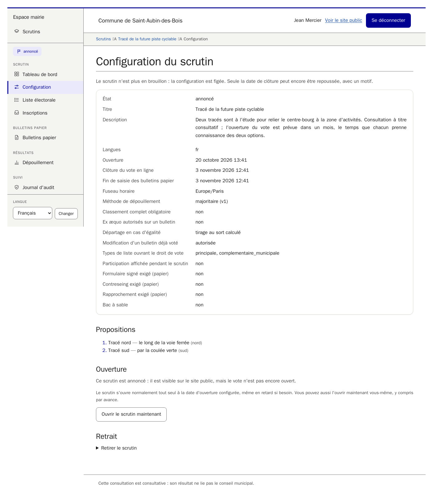

**Figure 12a — Configuration of an open poll past its deadline: *Close now* is offered.**

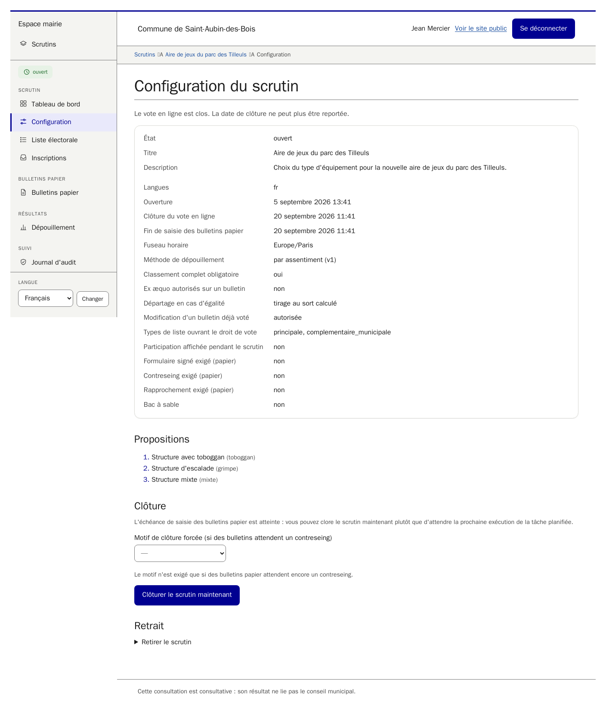

> An announced poll stays visible as-is on the public site until it opens:
> the page cannot change under the eyes of a voter who has already viewed
> it, since the configuration is frozen from the moment it is announced.
>
> **Figure 02 — Public page of an announced poll.**
>
> 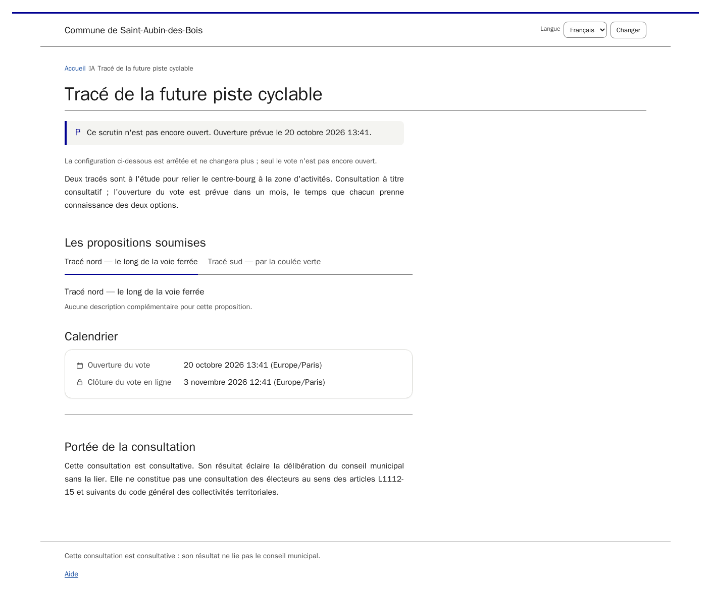

### Dashboard (screen 1)

State, dates, counters (registered / confirmed / online votes / paper votes
/ have not voted), the number of registrations awaiting review, and **the
actions allowed in the current state**.

- While a **draft**, it names any condition that would make opening fail —
  a missing translation, an unfrozen electoral roll — so that a gap is
  visible **before** the opening time, not at the opening time.
- While **open**, it names whatever would block closing — *closing
  blocked: n ballots awaiting countersignature*, or, if
  `paper_requires_reconciliation` is enabled and not yet recorded, *closing
  blocked: paper-ballot reconciliation not recorded*.
- Turnout is **counted from registrations, never from ballots**; on a
  closed poll, the counters shown are the ones frozen at closing, not a
  fresh count (the registrations behind a fresh count are deleted two
  months later — a fresh count would then read zero).

**Figure 11 — Dashboard of an open poll.**

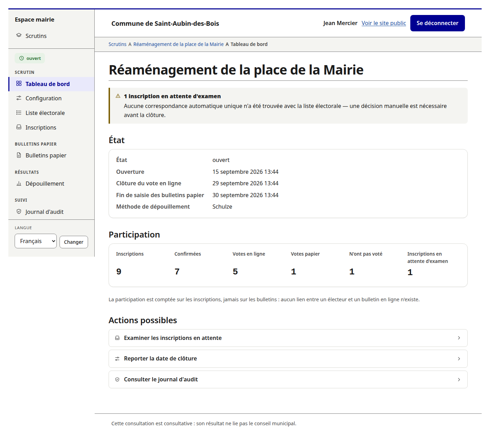

## 4. Poll configuration (screen 2)

A poll comprises: a title; a description; an **ordered list of at
least two propositions**; opening date and time; closing date and time; a
time zone; a tally method and its version; ballot constraints (a complete
ranking required or not, ties allowed or not); a tie-break rule; whether or
not a cast ballot can be **changed**; whether or not turnout is shown while
the poll runs; the electoral-list types that grant eligibility; enabled
languages; the paper channel's formal requirements; a "test poll" flag.

### Configuration freezes at announcing

It is **freely editable while a draft**, **immutable as soon as the poll
leaves draft** — at announcing, the only way out of draft. The rule is held by a **database trigger**, not only by the
application: `state != draft`.

**Only exception**: the **closing date** can be **extended** while the poll
is open, through a separate, justified action. The extension is
logged (operator, timestamp, **mandatory reason**) and **shown on the
poll's public page**. The paper-ballot keying deadline follows it.

> A test poll (`is_sandbox`) is set at creation and **cannot be changed**;
> it is excluded from public listings, published results and any statistics
>.

### Withdrawing the poll

From the **announced**, **open**, **closed** or **published** states, the
bottom of the configuration screen offers **"Withdraw the poll"**, with a
**mandatory reason** logged to the audit trail. Withdrawal is
**irreversible**: the poll moves to the `withdrawn` state, from which no
transition leaves. From withdrawal onward, nothing of this poll appears on
the public site any more — the address that carried its public page now
only shows a withdrawal notice, with none of its title, description,
propositions or result. Once withdrawn, this screen in turn becomes a
read-only view, naming the reason and the moment of withdrawal. Withdrawal
deletes neither the ballots nor the audit log; nor can it erase a copy of
the result a third party may already have downloaded before the withdrawal
took place.

### Propositions and identifiers

Each proposition carries an **identifier** (`option_id`, e.g. `garden`) and
a **label** per language. The tally and the hash rest on the
**identifiers**, never on the labels: the result is independent of the
labels and their translations. **Do not change an identifier
afterwards**: the ballots and the published result carry it.

The number of propositions is not limited (**at least two**). Each
row carries a **"Position"** field: it is this number, not the order of the
rows on screen, that fixes the order of the propositions on this page and
in the results — retyping a number is enough to reorder, with no
drag-and-drop needed. The ballot draws its own order for each voter,
independent of this position. The **"Add a proposition"** button inserts a
row, placed at the end of the list by default; each row's **"Remove"**
button deletes it — for an already-saved proposition, removal is reversible
as long as the configuration has not been saved. With no JavaScript, the two
blank rows at the end of the form serve to add, and each row's
**"Delete"** checkbox to remove.

### Extended description and images

Beyond its label, each proposition can be given an **extended description**
per language: formatted text, images hosted by the platform itself, a
YouTube video — never third-party content loaded by a bare address. Purely
informational: it **does not count toward the mandatory translation**
below (an enabled language with no extended description falls back to the
poll's default language's, or stays blank, never blocking announcing or
opening), **nor toward the tally or the closure hash**, which rest only on
the identifiers.

The field only appears once the proposition itself has been saved: its
label is entered first, the configuration is saved, and then the
description and images are added on a later visit. An uploaded image is
given a reference (`image:…`) to copy verbatim into the text, in
parentheses: ``. A video is signalled by a dedicated
block carrying the bare YouTube id alone on its line. The text otherwise
accepts simple formatting (bold, italics, links, lists, headings); any other
tag typed directly is stripped on display.

Like the rest of the configuration, the description and images can only be
changed **while the poll is a draft** — replacing an image never
overwrites the old one, it takes a new address, for the same reason an
identifier does not change afterwards: a reference already frozen must
never later end up pointing to different content. 5 MB per image, in PNG,
JPEG, GIF or WebP, recognised from the file's actual content, never from the
declared extension.

### Languages

The interface is translated through a catalogue; the title, description and
labels are translated for each enabled language. **A poll can be neither
announced nor opened while a translation is missing**; a missing
translation falls back to the poll's default language, never to nothing.
French is authoritative. A proposition's **extended description** (above) is
an exception: it is never required, in any language.

**Figure 13 — Editable configuration (draft poll), with *Announce now* at the bottom of the form — the only transition action offered while the poll is a draft.**

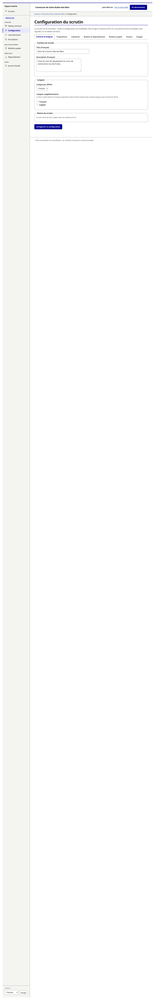

**Figure 12b — Read-only configuration (open poll), with the closing-date extension as a separate action.**

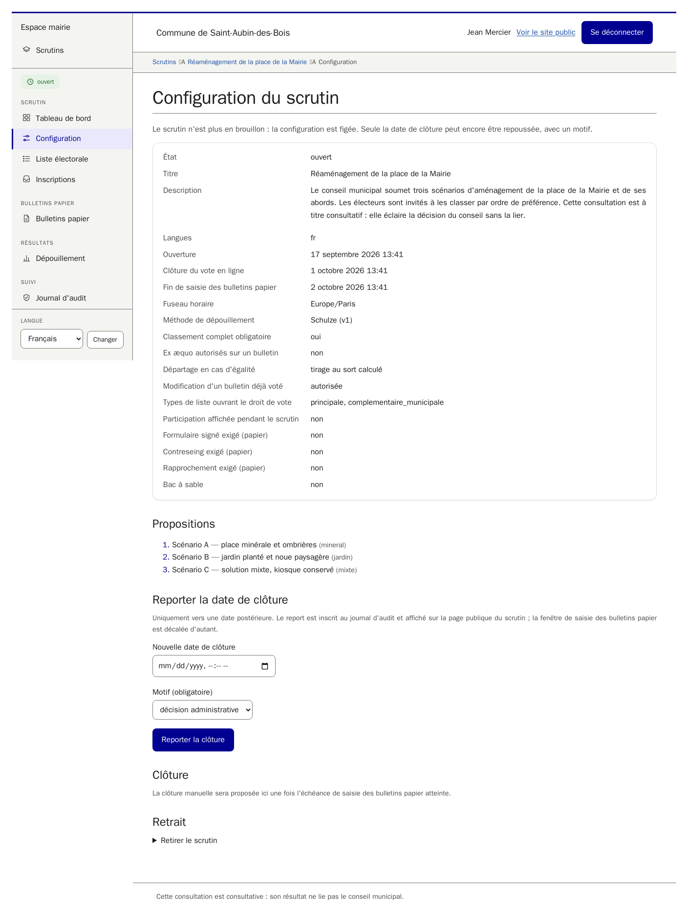

> Figures 12a, 12b and 02a show this same screen in the **announced**
> and **open past its deadline** states, and what the second shows on the
> public site.

### Tally methods

| Method | Use |
|---|---|
| **Schulze** | preferential poll: voters rank the propositions. |
| **Plurality** (`plurality`) | single choice. |
| **Approval** (`approval`) | the voter approves as many propositions as they like. |

If a complete ranking is not required, Schulze treats unranked propositions
as tied for last place.

For a detailed explanation of each method — with a worked example and, for
whoever wants it, the exact source code behind the computation — see [Tally
methods, explained](methodes-de-depouillement.md).

### Tie-break

In case of a genuine tie, the default rule is a **computed drawing of
lots**: reproducible and verifiable by a third party, with no
programming-language pseudo-random generator. The opening seed is published
at opening; the tie-break seed is `H(opening seed ‖ closure hash)`. A
configurable alternative: a public **physical drawing of lots**, whose
result is entered on the closing screen and recorded in the publication.

## 5. Electoral roll import (screen 3)

Reserved to the **commune administrator**. A new import **entirely
replaces** the working roll and **has no effect on a poll already open**
(which works from its own frozen snapshot).

**Fields imported, and only those**: birth surname, name in use,
first names, date of birth, electoral-list type. Not sex, nationality, place
of birth, polling station or order number. (Nationality reveals national
origin and is in any case implied by the list type. The order number is
neither unique nor stable.) The address is only imported if postal
registration is configured.

### Steps

1. **Choosing the file**, `.csv` or `.xlsx`.
2. **Column matching**, a **preliminary validation report** and a
   **preview**, on a second screen, subject to **explicit confirmation**.
3. **Transactional execution**: all or nothing.

The import is logged with the **file name, its SHA-256 hash, the number of
rows** and the operator's identity.

**Figure 15 — Screen 3: uploading the file and viewing the roll currently in force.**

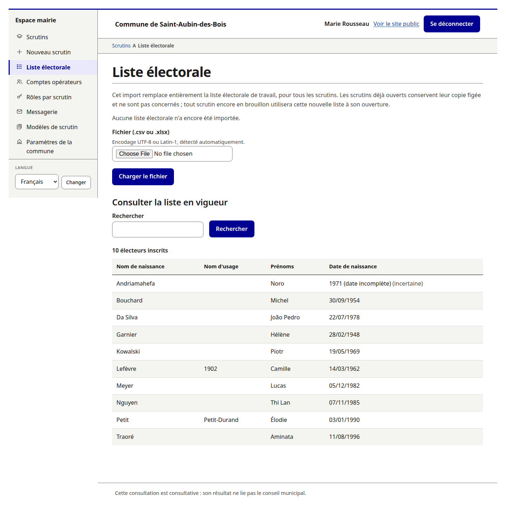

### Viewing the roll currently in force

The same screen shows, below the upload form, the roll currently in force —
birth surname, name in use, first names, date of birth — paginated and
searchable by substring. This is a simple alphabetical lookup, distinct
from the resemblance-based confirmation of the paper-entry screen: it
answers "who is on the roll right now", not "which entry matches the person
present".

### A poll's frozen snapshot stays viewable

Once a poll is open, its own **"Electoral roll"** menu no longer shows the
commune import's status but its **own frozen snapshot** (`RollEntry`), with
the same paginated search — open to the **poll administrator** as well as
the **auditor**, so that who was eligible stays verifiable afterwards. A
roll whose two-month retention has elapsed states this explicitly
rather than looking like an empty list or a search with no results.

**Figure 15a — Frozen electoral-roll snapshot of an open poll.**

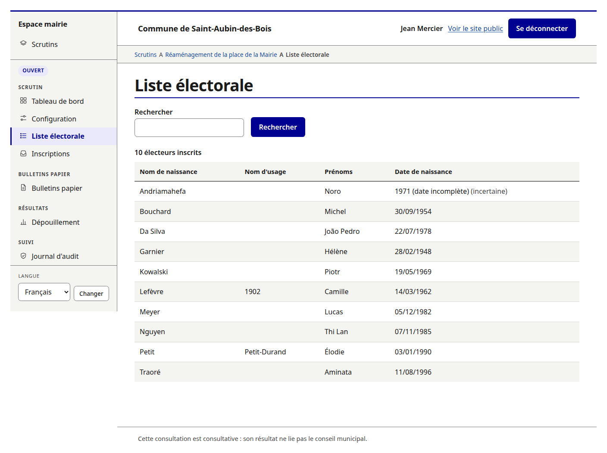

### Retention of an unused working roll

A roll that was imported but that no poll still in **draft or announced**
consumes any longer is **deleted two months after its import** — the same
scheduled job, the same lock, as the per-poll purge; only the working
entries disappear, the import's provenance (`RollImport`: file name, hash,
number of rows) and the log remain.

### The report informs, it does not block

**Only a structurally unusable file stops the import** — and then nothing
is written:

- **Blocking**: an unmapped required column; a row with no name at all.
- **Flagged and imported**: a date of birth that cannot be parsed (row
  flagged "uncertain date", kept as-is); an incomplete row (no
  list type); rows that merge; two entries with the same normalised name
  and the same date of birth that **do not** merge — a fact about the
  roll, not a defect in the file, left to human judgement.

### Merging rows

The export carries **one row per voter and per list type**. The import
merges rows with the same normalised identity (name + date of birth) into a
single entry carrying the **union of the list types**. Without this merge,
the same person would have two entries and could register twice. A row
flagged "uncertain date" is not merged.

### Eligibility by list type

Eligibility is filtered by list type, **configured for each poll**. A
municipal question concerns the *main list* and the *supplementary
municipal list*; being registered only on the *supplementary European
list* does not give a vote on such a question.

### From the command line

```sh
polls-manage import_roll <path> --operator <account-id> [--dry-run]
```

`--dry-run` validates and shows the report without writing anything. The
same transactional logic is shared with screen 3.

## 6. Registration queue (screen 4)

Reserved to the **poll administrator**. This is where decisions are made on
registrations that could not be automatically matched against the frozen
snapshot.

A registration is **put under review** when: no entry matches;
several entries match; the matching entry is flagged "uncertain date". (A
single match whose list types do not grant eligibility is **not** put under
review: it is **refused**, with a recorded reason.)

For each request, the screen shows the declaration and the roll's **nearby
entries**. The administrator **accepts** it — choosing the roll entry, after
which the registration moves to **awaiting address confirmation**, never
directly to the active state — or **refuses** it. Both decisions require a
**reason** and are logged. The person is told that their registration is
under review.

> Two decisions are shown side by side and distinguished by their label,
> never by colour alone (RGAA).

**Figure 14 — Registration queue.**

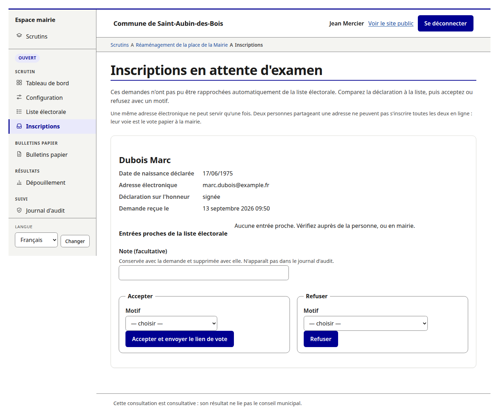

### Duplicate attempts

An attempt to register against a roll entry that is **already registered**
is refused, invites the person to contact the mairie, is logged and
**flagged to the poll administrator**. No detail of the existing
registration is disclosed. Likewise, a **single email address** can only be
used once per poll: two people sharing a mailbox cannot both
register online — their way in is **paper voting at the mairie**. The
screen's help text recalls this.

## 7. Paper ballots

For a voter with no internet access, an **entry operator** records a ballot
on their behalf.

### Formal requirements, per poll

Chosen at configuration time, none enabled by default:

- a **signed paper form** collected;
- a **countersignature** by a second operator;
- **formal reconciliation** at closing — the forms kept by the commune are
  reconciled against the ballots recorded, in a signed and archived report.

In every case, the **minimal traceability core** applies.

### Entry (screen 5)

**Figure 16 — Keying in a paper ballot: searching for the voter.**

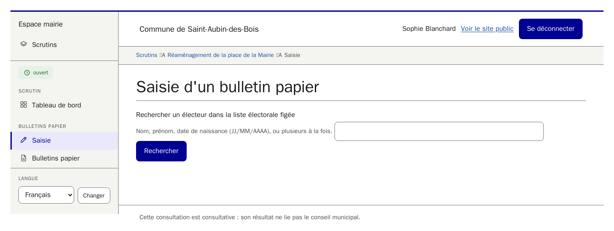

1. **Search for the voter** in the frozen snapshot (surname, first name,
   date of birth, or several at once). The screen shows **nearby entries**
   for confirmation. If two entries cannot be told apart from the data held,
   the operator decides **with the voter present**, not from the record
   alone.

   **Figure 16a — Search results, with a match indicator.**

   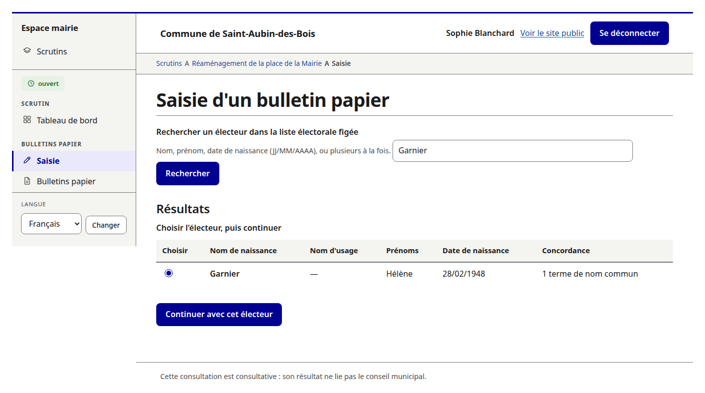

2. **Check the voter's voting channel**:
   - **paper already recorded** → this is a **correction** of the existing
     ballot (screen 6), not a new entry;
   - **online already recorded** → **entry refused**. A ballot voted online
     is anonymous and cannot be located from the registration: it
     can be neither replaced nor deleted. If the poll allows changes, the
     screen points the voter to **their** online change link; otherwise, it
     states that the online vote is final;

     **Figure 16b — Blocking interstitial: the voter has already voted online.**

     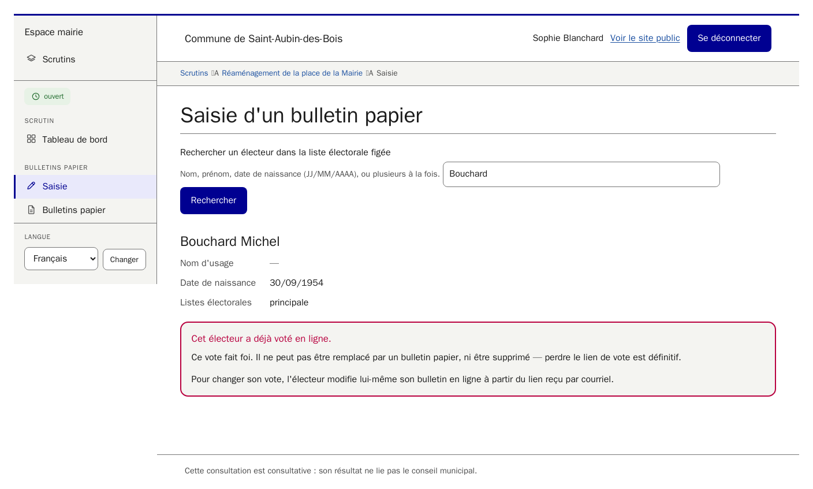

   - **none** → proceed.
3. **Enter the ranking** according to the poll's constraints.
4. **Print the receipt** carrying the **tracking code**, handed to the
   voter (an HTML page with a print stylesheet).

The receipt (and, failing that, the signed form) states that a ballot cast
on paper **stays associated with the voter's identity** in the system —
unlike a ballot voted online — for traceability purposes and possible
deletion at their request.

**Figure 16c — Paper vote receipt (printable).**

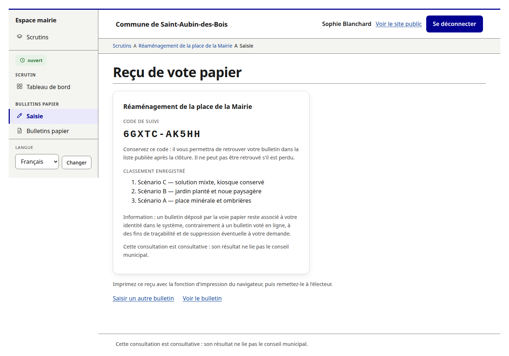

### Correction and deletion (screen 6)

Available to the operator, each with a **mandatory reason** and an audit
event recording the operator, the timestamp and the **before/after** state
. **Correction** stays possible whether or not the poll allows
voters to change their vote: fixing a keying mistake is not the same act as
a voter changing their mind. **Deletion** clears the channel flag and
**reopens online voting** for the voter concerned.

**Figure 16d — List of paper ballots entered.**

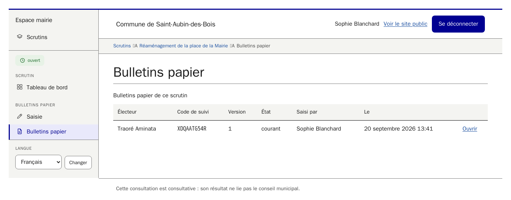

### The entry window

Paper ballots can be entered up until `paper_entry_deadline`, equal to the
closing time unless a window is configured. Entry is a **transcription**,
not a vote: the ballot was physically cast before closing, and the signed
form is the evidence for that; the timestamp of the keystroke is an
administrative artefact. **Online voting stops at closing, no matter
what.** Both instants are shown publicly: a stretch during which ballots
can still land in the database is precisely the kind of thing that looks
bad when discovered rather than announced.

### Countersignature (screen 7)

Present **only** if `paper_requires_countersign` is enabled. A queue of
entries awaiting a named second operator. While an entry is waiting, it
**is not counted**. The countersignature is itself a write on the ballot
and stays allowed within the same window as the entry.

## 8. Closing and publication (screen 9)

**Figure 17 — Closing and publication.**

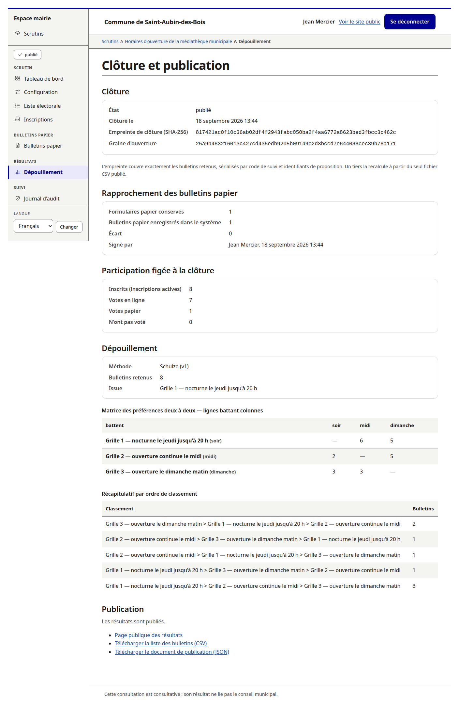

At closing, the screen shows the **closure hash** (SHA-256 covering exactly
the retained ballots, serialised by tracking code and proposition
identifiers), the **opening seed**, the **frozen counters**, then the
**tally** (method, version, pairwise matrix, reasoning) and, where
applicable, the **tie-break computation**. The **Publish** action makes
these artefacts public.

### Closing refuses to drop ballots silently

Closing is **refused** while an entry awaits countersignature. The poll
administrator either obtains the countersignatures, or **overrides it with
a mandatory reason**, which is recorded and **appears in the publication**.
Uncountersigned entries are not counted, and silently dropping ballots at
closing is not allowed.

### Paper-ballot reconciliation

Present **only** if `paper_requires_reconciliation` is enabled. Once
`paper_entry_deadline` has been reached — the same deadline that governs
screen 2's manual closing — the poll administrator counts the **paper forms
kept** by the commune and enters their number; it is checked against the
number of **paper ballots actually recorded** in the system, which is
computed and never entered by hand. Any gap between the two is shown but
blocks nothing: it is an observed fact, not an error to fix before
continuing. Figure 17 above shows the state once signed, between the
closure hash and the frozen turnout.

Unlike the countersignature, **there is no override**: as long
as the poll carries `paper_requires_reconciliation` and no reconciliation
is recorded, closing stays blocked, whether manual or scheduled. Once
signed, a second recording is refused — reconciliation is not corrected, it
is recorded once. The action is logged to the audit trail
(`RECONCILIATION_RECORDED`) and the report stays viewable afterwards by the
poll administrator and the auditor — **archived, never published**: unlike
the countersignature override, it must be "signed and archived", not made
available to the public.

### What gets published

- the **anonymised list of ballots** (tracking code + ranking) in CSV and
  JSON — **the retained ballots and nothing else**;
- the **pairwise preference matrix**;
- the **reasoning** leading to the result;
- the number of registered voters, the number of ballots per channel, the
  number of voters who did not vote;
- the **opening seed** and the **detail of any tie-break**;
- the **closure hash**.

When the number of propositions is small, a **summary table** giving the
number of ballots per distinct ordering is published as well (for three
fully-ranked propositions: six rows, enough to recompute the result).

The **result itself is put forward**, not merely available: on the results
page, the winner (or the tie, or the absence of a retained ballot) opens the
page in a separate panel, ahead of the method,
the matrix and the verification data. The **public list of polls** carries
this same result in one line for each published poll, with a direct link to
the full derivation — a visitor no longer needs to open the poll's page
first and then follow a second link to find out what came of it.

### From the command line

```sh
polls-manage run_tally <poll-id>   # tallies a closed poll, writes the artefacts
```

The tally is a **pure function**: the set of retained ballots + method +
parameters → winner, intermediate results, reasoning. It reads **only** the
ballots, never the voter register, and only runs after closing. The method
and its version are recorded with the poll, so a published result stays
reproducible despite later code changes.

## 9. The two channels competing (R-9 summary)

| Voter's state | Online vote | Paper entry |
|---|---|---|
| no ballot | allowed | allowed |
| **paper** recorded | **refused** — come to the mairie to have the paper ballot deleted first | this is a correction (screen 6) |
| **online** recorded | this is a change, if the poll allows it | **refused** — the online vote stands and can be neither moved nor deleted |

An operator deleting a paper ballot clears the flag and reopens online
voting.

## 10. Audit log (screen 8)

**Figure 21 — Audit log.**

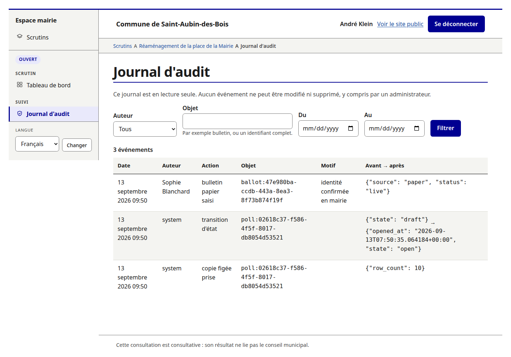

Read-only, filterable by author, date and object. Visible to the **poll
administrator** and the **auditor**. **No event can be changed or deleted**,
in the application as in the database.

The log records at least: configuration changes; state changes and
closing-date extensions; imports and frozen roll snapshots; decisions made
on registrations under review; refused registration attempts; creation,
correction and deletion of paper ballots; countersignatures and overrides at
closing; paper-ballot reconciliation; overrides of the
cross-channel warning; role assignments; and **accesses to the log itself**.

Each entry shows the operator, the timestamp, the object, the
**before/after** state and the reason where one is required. Events store a
**reference plus non-identifying state** — never a name, a date of birth or
an address; the reason is a **code**, never prose. An operator's prose lives
on the referenced row (the registration, the paper-ballot link), which is
where the retention purge picks it up.

## 11. Data protection — what the mairie area needs to know

- **The commune is the data controller**. The processing appears
  in the record of processing activities.
- An **information notice** is shown at registration (purpose, legal basis,
  retention periods, recipients, rights, the referent's identity).
  The referent is the one entered at first-run setup, editable afterwards
  from the commune settings (screen 14).
- **Retention periods**: identity data (registrations, the frozen
  roll snapshot, the paper-ballot ↔ voter association) is deleted **two
  months after closing**, or after **withdrawal** for a poll
  withdrawn before being closed; the "personal data" fields of the audit
  log are erased on the same term, **while keeping** the entry, its author,
  its date and its reason. Starting point: **closing**, or failing that
  **withdrawal**, never publication (a closed poll never published, or one
  withdrawn before being closed, would otherwise keep this data
  indefinitely). Anonymised ballots, the published result if any, and the
  log are kept beyond that. The imported **working roll** follows a
  related but distinct rule: it is deleted **two months after
  its import**, unless a poll still in **draft or announced** still needs
  to consume it at opening — a different starting point (the import, not
  the closing) since it belongs to no particular poll.
- Access to **identity data** is restricted to the **poll administrator**
  (a residual risk whose acceptance is for the commune to decide).

## 12. Starting screen: the poll index

**Figure 10 — Mairie-area poll index (as seen by a commune administrator).**

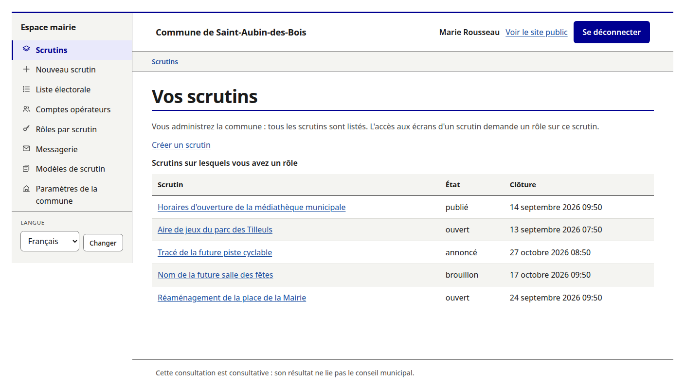

A commune administrator sees **every** poll (knowing what exists is
necessary to assign roles); other operators only see the polls on which
they hold a role. **Seeing a poll in this list is not access to its
screens**: that always requires a grant.

## 13. Commune settings (screen 14)

Reserved to the **commune administrator**, like screens 10, 12 (mail relay)
and 13 (poll templates). Carries, editable afterwards, the three fields
screen 11 sets at installation: the **commune's name** (shown on the
public pages and in the information notice), the **data-protection
referent** and their **contact details**.

Two elements specific to this screen are added:

- the **site's address** (`public_base_url`), used to build the absolute
  links in emails sent to voters (registration confirmation, receipt…) — by
  default, the address configured at the deployment level is authoritative,
  the same way screen 12's SMTP relay falls back to its own default
  configuration;
- a **logo** and a **favicon**, both optional: the first shown in the
  header in place of the commune's name, the second in the browser tab.

Each image is uploaded and deleted **separately** from the main form, like a
proposition's images — a file field left blank never means "keep the
current image" — and is validated on its **actual content**, never on the
declared extension (never SVG either, since no code in the application knows
how to sanitise one before serving it again): 2 MB maximum for the logo, 256
KB for the favicon. A commune that has not yet filled in this screen is
unaffected: a plain name in the header, the browser's default favicon.

Every save is logged, naming only the **fields that changed** — never their
value, the same restraint as for a poll's configuration or screen 12's
mail relay.

**Figure 22 — Commune settings.**

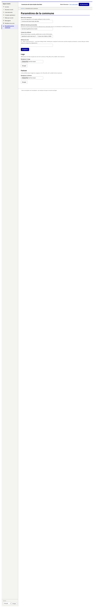
