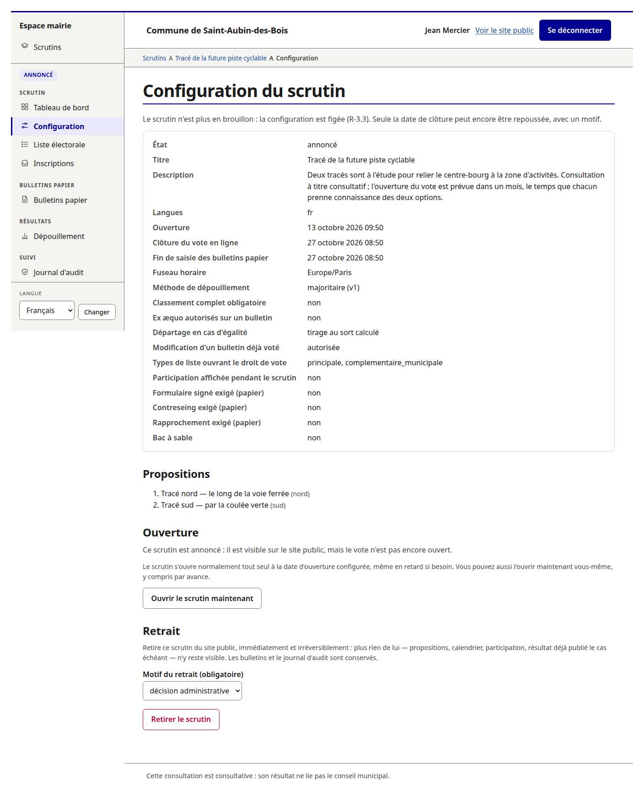
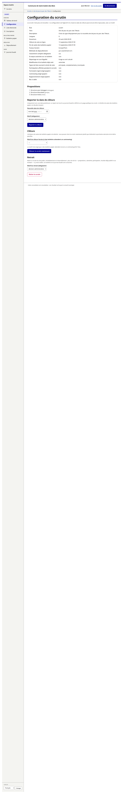
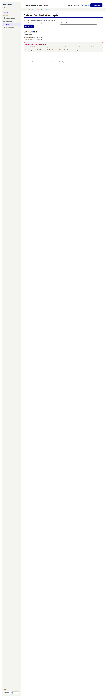
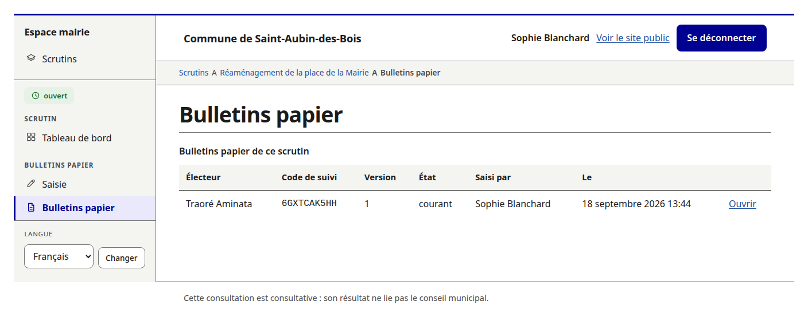

<!-- SPDX-License-Identifier: 0BSD -->

# Guide de l'espace mairie

L'espace mairie (`/mairie/`) est l'interface d'administration : élus et agents y
créent les scrutins, importent la liste électorale, traitent les inscriptions,
saisissent les bulletins papier, clôturent et publient. Elle est en français,
conforme au RGAA, utilisable au téléphone, et **ne présente jamais une action
destructrice à côté d'une action de routine** (R-2.4).

> **Ce que l'espace mairie ne permet pas.** Associer un électeur ayant voté **en
> ligne** au bulletin qu'il a déposé. Aucun rôle ne le permet (R-2.3, R-7.4).
> Un administrateur ne dispose que de deux listes inconciliables : les noms avec
> un indicateur « a voté / n'a pas voté », et les classements anonymes
> identifiés par leur code de suivi (R-7.5). La seule exception voulue est
> l'écran de saisie d'un bulletin **papier**, où l'association est délibérée,
> tracée, et effacée à l'échéance de rétention.

## 1. Rôles et accès

Les rôles s'attribuent **scrutin par scrutin**, sauf celui d'administrateur de
la commune (R-2.1).

| Rôle | Portée | Permissions |
|---|---|---|
| **Administrateur de la commune** | commune | Crée les scrutins ; attribue les rôles de chaque scrutin ; importe la liste électorale. **Ne donne accès à aucun bulletin** ni à aucun écran d'un scrutin en particulier. |
| **Administrateur du scrutin** | un scrutin | Modifie la configuration tant que le scrutin est en brouillon ; annonce, ouvre, clôt et publie ; statue sur les inscriptions mises en examen ; reporte la date de clôture. |
| **Opérateur de saisie** (élu·e) | un scrutin | Saisit, corrige et supprime les bulletins papier ; délivre les reçus. |
| **Auditeur** | un scrutin | Lecture seule : configuration, liste anonymisée des bulletins, **intégralité** du journal d'audit. |

Points de contrôle appliqués à **tous** les écrans d'un scrutin
(`apps/backoffice/access.py`) :

- `commune_admin` **n'est pas un super-utilisateur**. Le drapeau ouvre les
  écrans commune (comptes, rôles) et l'index des scrutins ; il ne confère aucun
  rôle sur un scrutin. Un administrateur de commune qui doit saisir un bulletin
  papier **s'attribue d'abord** le rôle d'opérateur, ce qui écrit un événement
  d'audit. C'est voulu : l'écran où un électeur apparaît à côté d'un contenu de
  bulletin doit être atteint par une attribution que quelqu'un a faite, pas par
  un drapeau que quelqu'un possède.
- `is_superuser` n'est **jamais** consulté.

### Se connecter

Chaque opérateur a un **compte nominatif** (R-2.2). Les comptes partagés sont
interdits par construction. Le nom de la personne connectée est affiché en haut
de chaque écran : on doit voir d'un coup d'œil au nom de qui le journal d'audit
va enregistrer les actions.

**Figure 6 — Connexion à l'espace mairie.**


## 2. Mise en route d'une instance neuve

1. **Première installation** (`/mairie/installation/`) — écran 11. Disponible
   uniquement tant qu'aucun compte n'existe ; il se ferme définitivement ensuite.
   Il crée en une transaction :
   - la **fiche commune** : nom affiché sur les pages publiques, **référent
     données personnelles** et **contact du référent** (à qui les électeurs
     adressent accès, rectification, effacement — R-13.2) ;
   - le **premier compte administrateur de la commune**.

   Ces trois champs de la fiche commune, ainsi que l'adresse du site et un
   logo/favicon facultatifs, restent modifiables ensuite depuis les
   **paramètres de la commune** (écran 14, §13).
2. **Comptes et rôles** (écran 10) — créer les comptes des élus et agents, puis,
   une fois un premier scrutin créé, leur attribuer les rôles sur ce scrutin.
3. **Import de la liste électorale** (écran 3) — voir §5.
4. **Créer le premier scrutin** (ci-dessous) puis **le configurer** (§4).

**Figure 18 — Comptes opérateurs.**


**Figure 19 — Rôles par scrutin.**


L'écran se parcourt en deux temps. Le **scrutin** se cherche et se choisit
dans une liste paginée, cherchable par intitulé et filtrable par état — pas
dans un menu déroulant unique, qui grossirait sans limite au fil des scrutins
de la commune. Le scrutin choisi affiché, une **grille** met chaque **compte
actif** en ligne et chaque **rôle** de §1 en colonne : une case cochée
attribue, une case décochée retire, le tout envoyé en un seul
enregistrement — seules les cases réellement changées écrivent un événement
au journal, une attribution ou un retrait à la fois (§10). Un compte
désactivé ne figure plus dans la grille : il ne peut pas recevoir de nouveau
rôle, et retirer un rôle qu'il détient encore passe par sa réactivation au
préalable, qui le fait réapparaître, coché, pour qu'on puisse l'en retirer.

Toute attribution de rôle est tracée au journal (§10).

### Créer un scrutin (`/mairie/nouveau/`)

Réservé à l'**administrateur de la commune** (comme les écrans 10 et 12) : un
scrutin qui n'existe pas encore n'a pas d'administrateur de scrutin à qui
réserver l'écran. Reprend le formulaire et l'éditeur de propositions de
l'écran 2 (§4) — la configuration initiale a la même forme qu'une
modification — en y ajoutant un seul champ que l'écran 2 exclut : le
**bac à sable** (R-3.7), fixé une fois pour toutes à la création.

Deux façons de partir :

- à **vide** : une seule langue de saisie au départ (la langue par défaut du
  déploiement) ; en ajouter d'autres se fait comme sur l'écran 2, en changeant
  l'ensemble des langues puis en enregistrant ;
- à partir d'un **modèle** (écran 13, ci-dessous) : la méthode de dépouillement
  et les contraintes du bulletin sont reprises du modèle choisi, mais titre,
  description et propositions se saisissent toujours à neuf — un modèle ne
  porte jamais de contenu (R-3.9, §3.9).

Créer un scrutin **n'attribue aucun rôle** dessus, y compris à qui vient de le
créer (§1) : la validation renvoie directement vers « Rôles par scrutin »
(écran 10) pour que l'attribution reste l'étape séparée et tracée qu'elle est
partout ailleurs.

### Modèles de scrutin (écran 13)

Réservé à l'administrateur de la commune, comme les écrans 10 et 12. Un
catalogue de modèles nommés, commun à tous les scrutins de la commune — nom,
méthode de dépouillement, date de création — chacun renommable ou
supprimable depuis cet écran. Rien d'autre ne crée ou ne modifie un modèle :
le seul point d'écriture est
*enregistrer comme modèle*, disponible sur l'écran 2 (§4) **quel que soit
l'état du scrutin**, puisque les champs qu'il copie (méthode, contraintes du
bulletin) sont déjà figés dès la sortie du brouillon (INV-6). Supprimer un
modèle ici n'a aucun effet sur un scrutin déjà créé à partir de lui : les
champs ont été copiés à la création, pas référencés.

### Paramètres de messagerie (écran 12)

Réservé à l'administrateur de la commune. Le relais SMTP (hôte, port,
chiffrement, identifiants, adresse d'expédition) utilisé par **tous** les
scrutins de la commune, puisqu'un seul relais les sert tous. Laissé vide, un
scrutin continue d'utiliser la configuration du déploiement (§14 côté
administrateur d'instance) : remplir cet écran est donc sans risque, une
commune qui n'y touche pas n'est pas affectée. Le mot de passe ne se
réaffiche jamais une fois enregistré — un champ laissé vide au prochain
passage signifie « conserver le mot de passe actuel », jamais « l'effacer ».

Une action **« envoyer un message de test »** exerce les réglages déjà
enregistrés contre une adresse choisie, avant qu'un scrutin réel n'en dépende ;
l'erreur SMTP ou réseau, le cas échéant, s'affiche telle quelle. Chaque
enregistrement inscrit au journal quels champs ont changé — jamais leur
valeur, ni le mot de passe (§10).

## 3. Cycle de vie d'un scrutin

```
brouillon  ──►  [annoncé]  ──►  ouvert  ──►  clos  ──►  publié
                    │              │           │          │
                    └──────────────┴───────────┴──────────┴──►  retiré
```

**Aucune transition n'est réversible** (R-3.2). `Poll.state` n'est écrit que
par un seul module (`apps/elections/transitions.py`). Chaque changement d'état
a deux origines possibles :

- une **tâche planifiée** (`open_poll`, `close_poll`), qui peut tourner en
  retard, deux fois, ou pas du tout — d'où le tableau de bord qui nomme à
  l'avance ce qui bloquerait la transition suivante (ci-dessous) ;
- l'administrateur du scrutin, **à la main**, depuis l'écran de
  **configuration** (écran 2, §4) : *Annoncer maintenant*, *Ouvrir maintenant*,
  *Clôturer maintenant* et *Retirer le scrutin* (R-2.1). Les quatre passent par
  les mêmes fonctions gardées que les tâches planifiées, donc un scrutin qui ne
  pourrait pas s'ouvrir ou se clore tout seul ne peut pas non plus être forcé
  depuis l'écran — à l'exception du passage outre au contreseing (§8), que
  seul un humain peut motiver. Le retrait n'a, lui, aucune tâche planifiée
  équivalente : c'est une action manuelle et volontaire, ou rien.

- **brouillon → annoncé** (R-3.10, optionnelle) : rend le scrutin visible sur
  le site public — propositions et calendrier, sans inscription ni vote
  possibles — avant même son ouverture. Fige la configuration au même instant
  que l'ouverture l'aurait fait (même déclencheur INV-6), pour qu'elle ne
  change pas sous les yeux de qui la consulte déjà. **Refusée, comme
  l'ouverture, si une langue activée n'a pas sa traduction complète** (titre,
  description, libellés) : l'annonce fige la page publique, elle ne peut donc
  ni figer ni montrer une configuration qui manque encore d'une traduction.
  Elle ne demande en revanche pas la liste électorale figée, celle-ci n'étant
  tirée qu'à l'ouverture (§5). Un administrateur qui n'a pas l'usage de cette
  étape passe directement de brouillon à ouvert, comme avant qu'elle existe.
- **brouillon ou annoncé → ouvert** : fige une **copie immuable de la liste
  électorale** (R-4.3) et tire la **graine d'ouverture** (pour un éventuel
  départage, R-10.5). *Ouvrir maintenant* est permis à tout moment, y compris
  avant l'heure d'ouverture configurée : cela ne fait rien voter en avance,
  puisque les contrôles de fenêtre (§5.1) portent sur l'horloge, jamais sur
  l'état.
- **ouvert → clos** : calcule l'**empreinte de clôture** sur l'ensemble des
  bulletins retenus et **fige les compteurs de participation**. Ne dépouille
  pas. *Clôturer maintenant* n'est proposé qu'une fois l'échéance de saisie
  des bulletins papier atteinte — clore plus tôt figerait l'empreinte et les
  compteurs par avance de bulletins que la fenêtre d'écriture accepterait
  encore légitimement.
- **clos → publié** : le dépouillement (fonction pure) est exécuté et les
  artefacts de §9 deviennent publics.
- **annoncé, ouvert, clos ou publié → retiré** (R-3.11, à tout moment, motif
  **obligatoire**) : plus rien du scrutin ne reste sur le site public — ni
  propositions, ni calendrier, ni participation, ni résultat déjà publié le
  cas échéant. La page qui portait son adresse indique seulement qu'il a été
  retiré. Terminal : aucune transition n'en repart, comme pour *publié*. Les
  bulletins et le journal d'audit ne sont pas touchés ; côté conservation des
  données (§11), un scrutin retiré avant d'avoir été clos obtient, faute de
  date de clôture, un point de départ de rétention sur la date du retrait
  elle-même.

**Figure 12a — Configuration en lecture seule d'un scrutin annoncé, avec *Ouvrir maintenant*.**



**Figure 12b — Configuration d'un scrutin ouvert dont l'échéance est dépassée : *Clôturer maintenant* est proposé.**



> Un scrutin annoncé reste visible tel quel sur le site public jusqu'à son
> ouverture : la page ne peut pas changer sous les yeux d'un électeur qui
> l'aurait déjà consultée, puisque la configuration est figée dès l'annonce.
>
> **Figure 02a — Page publique d'un scrutin annoncé.**
>
> 

### Tableau de bord (écran 1)

État, dates, compteurs (inscrits / confirmés / votes en ligne / votes papier /
n'ont pas voté), nombre d'inscriptions en attente d'examen, et **les actions
permises dans l'état courant**.

- En **brouillon**, il nomme toute condition qui ferait échouer l'ouverture —
  traduction manquante, liste électorale non figée — pour qu'un manque soit
  visible **avant** l'heure d'ouverture, pas à l'heure d'ouverture.
- En **ouvert**, il nomme ce qui bloquerait la clôture — *clôture bloquée : n
  bulletins en attente de contreseing*.
- La participation est **comptée sur les inscriptions, jamais sur les
  bulletins** ; sur un scrutin clos, ce sont les compteurs figés à la clôture
  qui s'affichent, pas un comptage frais (les inscriptions derrière un comptage
  frais sont supprimées deux mois après — un comptage frais donnerait alors zéro).

**Figure 11 — Tableau de bord d'un scrutin ouvert.**


## 4. Configuration du scrutin (écran 2)

Un scrutin comprend (R-3.1) : titre ; description ; **liste ordonnée d'au moins
deux propositions** ; date et heure d'ouverture ; date et heure de clôture ;
fuseau ; méthode de dépouillement et sa version ; contraintes du bulletin
(classement complet exigé ou non, ex æquo autorisés ou non) ; règle de
départage ; autorisation ou non de **modifier** un bulletin déposé ; affichage
ou non de la participation en cours de scrutin ; types de listes conférant
l'éligibilité ; langues activées ; exigences formelles du canal papier ;
indicateur « scrutin test ».

### La configuration se fige à l'annonce ou à l'ouverture

Elle est **librement modifiable en brouillon**, **immuable dès que le scrutin
quitte le brouillon** — que ce soit à l'annonce (§3) ou, pour un scrutin qui ne
s'annonce pas, à l'ouverture directement (R-3.3, INV-6). La règle est tenue par
un **déclencheur de base de données**, pas seulement par l'application : les
deux transitions figent au même titre, `state != draft`.

**Seule exception** : la **date de clôture** peut être **reportée** pendant que
le scrutin est ouvert (R-3.4), par une action séparée et motivée. Le report est
inscrit au journal (opérateur, horodatage, **motif obligatoire**) et **affiché
sur la page publique** du scrutin. L'échéance de saisie des bulletins papier
suit.

> Un scrutin test (`is_sandbox`) est fixé à la création et **non modifiable** ;
> il est exclu des listes publiques, des résultats publiés et de toute
> statistique (R-3.7).

### Retirer le scrutin (R-3.11)

Depuis les états **annoncé**, **ouvert**, **clos** ou **publié**, le bas de
l'écran de configuration propose **« Retirer le scrutin »**, avec un **motif
obligatoire** consigné au journal d'audit. Le retrait est **irréversible** : le
scrutin passe à l'état `retiré`, dont aucune transition ne repart. Dès le
retrait, plus rien de ce scrutin n'apparaît sur le site public — l'adresse qui
portait sa page publique n'affiche plus qu'un avis de retrait, sans son
intitulé, sa description, ses propositions ni son résultat. Une fois retiré,
cet écran devient à son tour une consultation en lecture seule, nommant le
motif et l'instant du retrait. Le retrait ne supprime ni les bulletins ni le
journal d'audit ; il ne peut pas non plus effacer une copie du résultat qu'un
tiers aurait déjà téléchargée avant que le retrait n'intervienne.

### Propositions et identifiants

Chaque proposition porte un **identifiant** (`option_id`, ex. `jardin`) et un
**libellé** par langue. Le dépouillement et l'empreinte reposent sur les
**identifiants**, jamais sur les libellés : le résultat est indépendant des
libellés et de leurs traductions (R-10.7). **Ne changez pas un identifiant après
coup** : les bulletins et le résultat publié le portent.

Le nombre de propositions n'est pas limité (**au moins deux**, R-3.1). Le bouton
**« Ajouter une proposition »** insère une ligne ; le bouton **« Retirer »** de
chaque ligne la supprime — sur une proposition déjà enregistrée, le retrait est
réversible tant que la configuration n'est pas enregistrée. Sans JavaScript, les
deux lignes vierges en fin de formulaire servent à ajouter, et la case
**« Supprimer »** de chaque ligne à retirer.

### Description étendue et images (R-3.12)

Au-delà de son libellé, chaque proposition peut recevoir une **description
étendue** par langue : texte mis en forme, images hébergées par la plateforme
elle-même, vidéo YouTube — jamais de contenu tiers chargé par simple adresse.
Purement informatif : elle **n'entre ni dans la traduction obligatoire**
ci-dessous (une langue activée sans description étendue retombe sur celle de
la langue par défaut du scrutin, ou reste vide, sans jamais bloquer l'annonce
ni l'ouverture), **ni dans le dépouillement ou l'empreinte de clôture**, qui
ne portent que sur les identifiants (R-10.7).

Le champ n'apparaît qu'une fois la proposition elle-même enregistrée : on
saisit d'abord son libellé, on enregistre la configuration, puis on revient
lui ajouter description et images. Une image envoyée reçoit un repère
(`image:…`) à recopier tel quel dans le texte, entre parenthèses :
``. Une vidéo se signale par un bloc dédié
portant l'identifiant YouTube seul sur sa ligne. Le texte accepte par ailleurs
une mise en forme simple (gras, italique, liens, listes, titres) ; toute autre
balise tapée directement est retirée à l'affichage.

Comme le reste de la configuration, description et images ne se modifient que
**tant que le scrutin est en brouillon** (R-3.3) — remplacer une image
n'écrase jamais l'ancienne, elle prend une nouvelle adresse, pour la même
raison qu'un identifiant ne change pas après coup : une référence déjà figée
ne doit jamais se retrouver, plus tard, à pointer vers un contenu différent.
5 Mo par image, au format PNG, JPEG, GIF ou WebP reconnu sur le contenu réel
du fichier, jamais sur l'extension déclarée.

### Langues

Interface traduite par catalogue ; titre, description et libellés traduits pour
chaque langue activée. **Un scrutin ne peut être ni annoncé ni ouvert tant
qu'une traduction manque** (R-3.10) ; une traduction absente retombe sur la
langue par défaut du scrutin, jamais sur rien. Le français fait foi. La
**description étendue** d'une proposition (ci-dessous) fait exception : elle
n'est jamais exigée, dans aucune langue.

**Figure 13 — Configuration modifiable (scrutin en brouillon), avec *Annoncer* et *Ouvrir maintenant* en bas de formulaire.**


**Figure 12 — Configuration en lecture seule (scrutin ouvert), avec le report de clôture comme action distincte.**


> Les figures 12a, 12b et 02a (§3) montrent ce même écran dans les états
> **annoncé** et **ouvert au-delà de son échéance**, et ce que le second
> montre sur le site public.

### Méthodes de dépouillement (R-10.3)

| Méthode | Usage |
|---|---|
| **Schulze** | scrutin préférentiel : les électeurs classent les propositions. |
| **Majoritaire** (`plurality`) | choix unique. |
| **Par assentiment** (`approval`) | l'électeur approuve autant de propositions qu'il veut. |

Si le classement complet n'est pas exigé, Schulze traite les propositions non
classées comme ex æquo en dernière position (R-10.4).

### Départage (R-10.5)

En cas d'égalité réelle, la règle par défaut est un **tirage au sort calculé** :
reproductible et vérifiable par un tiers, sans générateur pseudo-aléatoire de
langage. La graine d'ouverture est publiée à l'ouverture ; la graine de
départage vaut `H(graine d'ouverture ‖ empreinte de clôture)`. Alternative
configurable : un **tirage au sort physique** public, dont le résultat est
saisi sur l'écran de clôture et inscrit dans la publication.

## 5. Import de la liste électorale (écran 3)

Réservé à l'**administrateur de la commune**. Un nouvel import **remplace
entièrement** la liste de travail et **n'a aucun effet sur un scrutin déjà
ouvert** (celui-ci travaille sur sa copie figée).

**Champs importés, et eux seuls** (R-4.2) : nom de naissance, nom d'usage,
prénoms, date de naissance, type de liste. Pas le sexe, la nationalité, le lieu
de naissance, le bureau de vote ni le numéro d'ordre. (La nationalité révèle
l'origine nationale et est de toute façon impliquée par le type de liste. Le
numéro d'ordre n'est ni unique ni stable — R-4.8.) L'adresse n'est importée que
si l'inscription postale est configurée.

### Étapes (R-4.5)

1. **Choix du fichier** `.csv` ou `.xlsx`.
2. **Correspondance des colonnes**, **rapport de validation préalable** et
   **aperçu**, sur un second écran, soumis à **confirmation expresse**.
3. **Exécution transactionnelle** : tout ou rien.

L'import est inscrit au journal avec le **nom du fichier, son empreinte SHA-256,
le nombre de lignes** et l'identité de l'opérateur.

**Figure 15 — Écran 3 : dépôt du fichier et consultation de la liste en vigueur.**


### Consulter la liste en vigueur

Le même écran affiche, sous le formulaire de dépôt, la liste actuellement en
vigueur — nom de naissance, nom d'usage, prénoms, date de naissance —
paginée et cherchable par sous-chaîne. C'est une consultation alphabétique
simple, distincte de la confirmation par ressemblance de l'écran de saisie
papier (§7) : elle répond à « qui figure sur la liste en ce moment », pas à
« quelle entrée correspond à la personne présente ».

### La copie figée d'un scrutin reste consultable (R-4.4)

Une fois un scrutin ouvert, son propre menu **« Liste électorale »** ne montre
plus le statut de l'import commune mais sa **copie figée à lui**
(`RollEntry`), avec la même recherche paginée — ouverte à
l'**administrateur du scrutin** comme à l'**auditeur**, pour que qui était
éligible reste vérifiable après coup. Une liste dont la rétention de deux mois
(R-13.3) est passée l'indique explicitement plutôt que de se confondre avec une
liste vide ou une recherche sans résultat.

**Figure 15a — Copie figée de la liste électorale d'un scrutin ouvert.**


### Rétention de la liste de travail non consommée (R-13.3 bis)

Une liste importée mais qu'aucun scrutin encore en **brouillon ou annoncé** ne
consomme plus est **supprimée deux mois après son import** — même job
planifié, même verrou que la purge par scrutin (§11) ; seules les entrées de
travail disparaissent, la provenance de l'import (`RollImport` : nom du
fichier, empreinte, nombre de lignes) et le journal restent.

### Le rapport informe, il ne bloque pas

**Seul un fichier structurellement inutilisable interrompt l'import** — et alors
rien n'est écrit :

- **Bloquant** : une colonne obligatoire non mappée ; une ligne sans aucun nom.
- **Signalé et importé** : une date de naissance qui ne s'analyse pas (ligne
  marquée « date incertaine », conservée telle quelle — R-4.9) ; une ligne
  incomplète (pas de type de liste) ; des lignes qui fusionnent ; deux entrées
  de même nom normalisé et même date de naissance qui **ne** fusionnent **pas**
  — un fait sur la liste, pas un défaut du fichier, laissé au jugement humain.

### Fusion des lignes (R-4.6)

L'export comporte **une ligne par électeur et par type de liste**. L'import
fusionne les lignes de même identité normalisée (nom + date de naissance) en une
seule entrée portant **l'union des types de listes**. Sans cette fusion, une
même personne aurait deux entrées et pourrait s'inscrire deux fois. Une ligne
« date incertaine » n'est pas fusionnée.

### Éligibilité par type de liste (R-4.7)

L'éligibilité est filtrée par type de liste, **configuré pour chaque scrutin**.
Une question municipale concerne la *liste principale* et la *liste
complémentaire municipale* ; être inscrit sur la seule *liste complémentaire
européenne* ne donne pas voix sur une telle question.

### En ligne de commande

```sh
polls-manage import_roll <chemin> --operator <identifiant-compte> [--dry-run]
```

`--dry-run` valide et affiche le rapport sans rien écrire. La même logique
transactionnelle est partagée avec l'écran 3.

## 6. File d'attente des inscriptions (écran 4)

Réservé à l'**administrateur du scrutin**. On y statue sur les inscriptions qui
n'ont pas pu être rapprochées automatiquement de la copie figée.

Une inscription est **mise en examen** (R-5.4) quand : aucune entrée ne
correspond ; plusieurs entrées correspondent ; l'entrée correspondante est
marquée « date incertaine ». (Un rapprochement unique dont les types de listes
ne confèrent pas l'éligibilité n'est **pas** mis en examen : il est **refusé**,
motif enregistré.)

Pour chaque demande, l'écran affiche la déclaration et les **entrées proches**
de la liste. L'administrateur **accepte** — il choisit alors l'entrée de la
liste, et l'inscription passe en **attente de confirmation d'adresse**, jamais
directement à l'état actif — ou **refuse**. Les deux décisions exigent un
**motif** et sont inscrites au journal. La personne est informée que son
inscription est à l'étude.

> Deux décisions sont présentées côte à côte et distinguées par leur intitulé,
> jamais par la couleur seule (RGAA).

**Figure 14 — File d'attente des inscriptions.**


### Tentatives de doublon (R-5.9)

Une tentative d'inscription contre une entrée de liste **déjà inscrite** est
refusée, invite la personne à contacter la mairie, est inscrite au journal et
**signalée à l'administrateur du scrutin**. Aucun détail de l'inscription
existante n'est divulgué. De même, une **même adresse électronique** ne sert
qu'une fois par scrutin (R-5.10) : deux personnes partageant une boîte ne
peuvent pas s'inscrire toutes les deux en ligne — leur voie est le **vote papier
à la mairie**. Le texte d'aide de l'écran le rappelle.

## 7. Bulletins papier

Pour un électeur sans accès à internet, un **opérateur de saisie** enregistre un
bulletin en son nom.

### Exigences formelles, par scrutin (R-8.2)

À choisir à la configuration, aucune activée par défaut :

- **formulaire papier signé** collecté ;
- **contreseing** par un second opérateur ;
- **rapprochement formel** à la clôture (les formulaires sont conservés par la
  commune et rapprochés des bulletins enregistrés, procès-verbal signé et
  archivé).

Dans tous les cas, le **noyau minimal de traçabilité** (R-8.3 à R-8.5)
s'applique.

### Saisie (écran 5)

**Figure 16 — Saisie d'un bulletin papier : recherche de l'électeur.**


1. **Rechercher l'électeur** dans la copie figée (nom, prénom, date de
   naissance, ou plusieurs à la fois). L'écran affiche les **entrées proches**
   pour confirmation. Si deux entrées ne peuvent pas être distinguées sur les
   données détenues, l'opérateur tranche **avec l'électeur présent**, pas depuis
   le dossier (R-8.3).

   **Figure 16a — Résultats de recherche, avec l'indication de concordance.**

   

2. **Vérifier le canal de vote** de l'électeur :
   - **papier déjà enregistré** → c'est une **correction** du bulletin
     existant (écran 6), pas une nouvelle saisie ;
   - **en ligne déjà enregistré** → **saisie refusée**. Un bulletin voté en
     ligne est anonyme et ne peut pas être localisé depuis l'inscription
     (R-7.4) : il ne peut être ni remplacé, ni supprimé. Si le scrutin autorise
     la modification, l'écran oriente l'électeur vers **son** lien de
     modification en ligne ; sinon, il indique que le vote en ligne est
     définitif (R-9.3) ;

     **Figure 16d — Interstitiel bloquant : l'électeur a déjà voté en ligne.**

     

   - **aucun** → on continue.
3. **Saisir le classement** selon les contraintes du scrutin.
4. **Imprimer le reçu** portant le **code de suivi**, remis à l'électeur (page
   HTML avec feuille de style d'impression).

Le reçu (et, à défaut, le formulaire signé) porte la mention qu'un bulletin
déposé par la voie papier **reste associé à l'identité de l'électeur** dans le
système — contrairement à un bulletin voté en ligne — à des fins de traçabilité
et de suppression éventuelle à la demande (R-8.2 bis).

**Figure 16c — Reçu de vote papier (imprimable).**


### Correction et suppression (écran 6)

Disponibles à l'opérateur, chacune avec un **motif obligatoire** et un événement
d'audit indiquant l'opérateur, l'horodatage et l'état **avant/après** (R-8.5).
La **correction** reste possible que le scrutin autorise ou non les électeurs à
modifier leur vote : réparer une erreur de saisie n'est pas le même acte qu'un
électeur qui change d'avis. La **suppression** efface l'indicateur de canal et
**rouvre le vote en ligne** pour l'électeur concerné (R-9.4).

**Figure 16b — Liste des bulletins papier saisis.**



### La fenêtre de saisie

Les bulletins papier peuvent être saisis jusqu'à `paper_entry_deadline`, égale à
la clôture sauf si une fenêtre est configurée. La saisie est une
**transcription**, pas un vote : le bulletin a été déposé physiquement avant la
clôture, le formulaire signé en fait foi ; l'horodatage de la frappe est un
artefact administratif. **Le vote en ligne s'arrête à la clôture, quoi qu'il
arrive.** Les deux instants sont affichés publiquement : une période pendant
laquelle des bulletins peuvent encore entrer en base est précisément ce qui a
mauvaise mine quand on le découvre au lieu de l'annoncer.

### Contreseing (écran 7)

Présent **uniquement** si `paper_requires_countersign` est activé. File des
saisies en attente d'un second opérateur nommé. Tant qu'une saisie attend, elle
**n'est pas comptée**. Le contreseing est lui-même une écriture sur le bulletin
et reste permis dans la même fenêtre que la saisie.

## 8. Clôture et publication (écran 9)

**Figure 17 — Clôture et publication.**


À la clôture, l'écran présente l'**empreinte de clôture** (SHA-256 couvrant
exactement les bulletins retenus, sérialisés par code de suivi et identifiants
de proposition), la **graine d'ouverture**, les **compteurs figés**, puis le
**dépouillement** (méthode, version, matrice deux à deux, raisonnement) et, le
cas échéant, le **calcul du départage**. L'action **Publier** rend publics les
artefacts de §9.

### La clôture refuse d'abandonner des bulletins en silence (R-8.7 bis)

La clôture est **refusée** tant qu'une saisie attend un contreseing. L'administrateur
du scrutin soit obtient les contreseings, soit **passe outre avec un motif
obligatoire**, qui est enregistré et **apparaît dans la publication**. Les
saisies non contresignées ne sont pas comptées, et l'abandon silencieux de
bulletins à la clôture n'est pas permis.

### Ce qui est publié (R-11.2)

- la **liste anonymisée des bulletins** (code de suivi + classement) en CSV et
  JSON — **les bulletins retenus et rien d'autre** ;
- la **matrice des préférences deux à deux** ;
- le **raisonnement** menant au résultat ;
- le nombre d'inscrits, le nombre de bulletins par canal, le nombre d'électeurs
  n'ayant pas voté ;
- la **graine d'ouverture** et le **détail de tout départage** ;
- l'**empreinte de clôture**.

Quand le nombre de propositions est petit, un **tableau récapitulatif** donnant
le nombre de bulletins par ordre distinct est publié en plus (pour trois
propositions entièrement classées : six lignes, suffisantes pour recalculer le
résultat).

Le **résultat lui-même est mis en avant**, pas seulement disponible (R-11.2,
R-11.4) : sur la page de résultats, le gagnant (ou l'égalité, ou l'absence de
bulletin retenu) ouvre la page dans un encart séparé, avant la méthode, la
matrice et les données de vérification. La **liste publique des scrutins**
reprend ce même résultat en une ligne pour chaque scrutin publié, avec un lien
direct vers la dérivation complète — un visiteur n'a plus besoin d'ouvrir
d'abord la page du scrutin puis de suivre un second lien pour savoir ce qui en
est sorti.

### En ligne de commande

```sh
polls-manage run_tally <identifiant-scrutin>   # dépouille un scrutin clos, écrit les artefacts
```

Le dépouillement est une **fonction pure** : ensemble des bulletins retenus +
méthode + paramètres → gagnant, résultats intermédiaires, raisonnement. Il ne
lit **que** les bulletins, jamais le registre des électeurs, et n'est exécuté
qu'après la clôture. La méthode et sa version sont enregistrées avec le scrutin,
donc un résultat publié reste reproductible malgré des changements de code
ultérieurs (R-10.2).

## 9. Concurrence des deux canaux (récapitulatif R-9)

| État de l'électeur | Vote en ligne | Saisie papier |
|---|---|---|
| aucun bulletin | autorisé | autorisée |
| **papier** enregistré | **refusé** — se présenter en mairie pour faire supprimer le bulletin papier au préalable | c'est une correction (écran 6) |
| **en ligne** enregistré | c'est une modification, si le scrutin l'autorise | **refusée** — le vote en ligne fait foi et ne peut être ni déplacé ni supprimé |

La suppression d'un bulletin papier par un opérateur efface l'indicateur et
rouvre le vote en ligne (R-9.4).

## 10. Journal d'audit (écran 8)

**Figure 21 — Journal d'audit.**


Lecture seule, filtrable par auteur, date et objet. Visible des **auditeurs**.
**Aucun événement ne peut être modifié ni supprimé**, dans l'application comme
dans la base (INV-3).

Le journal enregistre au minimum (R-12.1) : modifications de configuration ;
changements d'état et reports de clôture ; imports et copies figées de la liste ;
décisions rendues sur les inscriptions mises en examen ; tentatives
d'inscription refusées ; création, correction et suppression de bulletins
papier ; contreseings et passages outre à la clôture ; passages outre à
l'avertissement de concurrence des canaux ; attributions de rôle ; et **les
accès au journal lui-même**.

Chaque entrée indique l'opérateur, l'horodatage, l'objet, l'état **avant/après**
et le motif quand il en faut un. Les événements stockent une **référence + un
état non identifiant** — jamais un nom, une date de naissance ou une adresse ; le
motif est un **code**, jamais de la prose. La prose d'un opérateur vit sur la
ligne référencée (l'inscription, le lien de bulletin papier), là où la purge de
rétention la reprend.

## 11. Protection des données — ce que l'espace mairie doit savoir

- **La commune est responsable de traitement** (R-13.1). Le traitement figure au
  registre des activités de traitement.
- Une **notice d'information** est présentée à l'inscription (finalité, base
  légale, durées de conservation, destinataires, droits, identité du référent —
  R-13.2). Le référent est celui saisi à la première installation, modifiable
  ensuite depuis les paramètres de la commune (écran 14, §13).
- **Durées de conservation** (R-13.3) : les données d'identité (inscriptions,
  copie figée de la liste, association bulletin papier ↔ électeur) sont
  supprimées **deux mois après la clôture**, ou après le **retrait** (R-3.11)
  pour un scrutin retiré avant d'avoir été clos ; les champs « données
  personnelles » du journal d'audit sont effacés au même terme, **en
  conservant** l'entrée, son auteur, sa date et son motif. Point de départ : la
  **clôture**, ou à défaut le **retrait**, jamais la publication (un scrutin
  clos jamais publié, ou retiré avant de l'être clos, conserverait sinon ces
  données indéfiniment). Les bulletins anonymisés, le résultat publié s'il
  existe et le journal sont conservés au-delà. La **liste de travail** importée
  (§5) obéit à une règle
  voisine mais distincte (R-13.3 bis) : elle est supprimée **deux mois après
  son import**, sauf tant qu'un scrutin encore en **brouillon ou annoncé** doit
  la consommer à son ouverture — un point de départ différent (l'import, pas
  la clôture) puisqu'elle n'appartient à aucun scrutin en particulier.
- L'accès aux **données d'identité** est restreint à l'**administrateur du
  scrutin** (risque résiduel R-13.4 bis, dont l'acceptation relève de la
  commune).

## 12. Écran de départ : l'index des scrutins

**Figure 10 — Index des scrutins de l'espace mairie (vu par un administrateur de commune).**


Un administrateur de commune voit **tous** les scrutins (il faut savoir ce qui
existe pour attribuer les rôles) ; les autres opérateurs ne voient que les
scrutins sur lesquels ils ont un rôle. **Voir un scrutin dans cette liste n'est
pas un accès à ses écrans** : cela demande toujours une attribution.

## 13. Paramètres de la commune (écran 14)

Réservé à l'**administrateur de la commune**, comme les écrans 10, 12 (relais
de messagerie) et 13 (modèles de scrutin). Reprend, modifiables après coup,
les trois champs que l'écran 11 fixe à l'installation (§2) : le **nom de la
commune** (affiché sur les pages publiques et dans la notice d'information),
le **référent données personnelles** et son **contact** (R-13.1, R-13.2,
§11).

S'y ajoutent deux éléments propres à cet écran :

- l'**adresse du site** (`public_base_url`), utilisée pour composer les liens
  absolus des courriels envoyés aux électeurs (confirmation d'inscription,
  reçu…) — à défaut, l'adresse configurée au niveau du déploiement fait foi,
  de la même manière que le relais SMTP de l'écran 12 se rabat sur sa propre
  configuration par défaut ;
- un **logo** et un **favicon**, tous deux facultatifs : le premier affiché
  dans l'en-tête à la place du nom de la commune, le second dans l'onglet du
  navigateur.

Chaque image s'envoie et se supprime **séparément** du formulaire principal,
comme les images d'une proposition (§4) — un champ de fichier laissé vide n'y
signifie jamais « conserver l'image actuelle » — et est validée sur son
**contenu réel**, jamais sur l'extension déclarée (jamais de SVG non plus,
qu'aucun code de l'application ne sait nettoyer avant de le resservir) : 2 Mo
maximum pour le logo, 256 Ko pour le favicon. Une commune qui n'a pas encore
rempli cet écran n'est pas affectée : nom brut dans l'en-tête, favicon du
navigateur par défaut.

Chaque enregistrement est inscrit au journal, en ne nommant que les **champs
qui ont changé** — jamais leur valeur, la même retenue que pour la
configuration d'un scrutin (§4) ou le relais de messagerie de l'écran 12.

**Figure 22 — Paramètres de la commune.**


